---
## Front matter
lang: ru-RU
title: Лабораторная работа №1
subtitle: 
author:
  - Сунгурова М.М.
institute:
  - Российский университет дружбы народов, Москва, Россия
date: 07 сентября 2024

## i18n babel
babel-lang: russian
babel-otherlangs: english

## Formatting pdf
toc: false
toc-title: Содержание
slide_level: 2
aspectratio: 169
section-titles: true
theme: metropolis
header-includes:
 - \metroset{progressbar=frametitle,sectionpage=progressbar,numbering=fraction}
 - '\makeatletter'
 - '\beamer@ignorenonframefalse'
 - '\makeatother'
---

# Информация

## Докладчик

:::::::::::::: {.columns align=center}
::: {.column width="70%"}

  * Сунгурова Мариян Мухсиновна
  * НКНбд-01-21
  * Российский университет дружбы народов

:::
::: {.column width="30%"}

:::
::::::::::::::

# Цель работы 

## Цель работы

- Целью данной работы является приобретение практических навыков установки операционной системы на виртуальную машину, настройки минимально необходимых для дальнейшей работы сервисов.

# Выполнение лабораторной работы

## Установка виртуальной ОС

- В свойствах VirtualBox месторасположение каталога для виртуальных машин. 
(рис. [-@fig:001]).
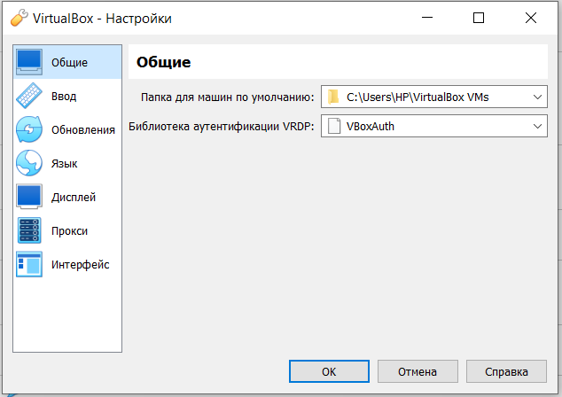{#fig:001 width=40%}

- Затем была создана новая виртуальная машину гдн имя виртуальной машины -- mmsungurova, тип
операционной системы — Linux, RedHat.
- Размер основной памяти виртуальной машины  — 2048МБ.

## Установка виртуальной ОС
- Затем задана конфигурация жёсткого диска — загрузочный,VDI (BirtualBox Disk Image), динамический виртуальный диск.(рис. [-@fig:002]).
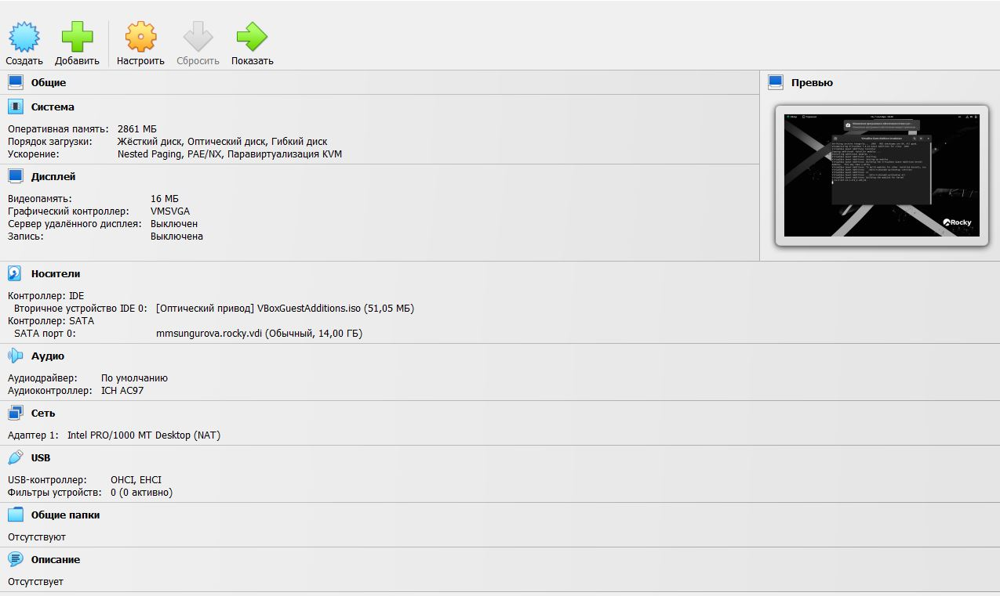{#fig:002 width=40%}

## Установка имени пользователя и названия хоста

- При установке было задано имя пользователя -- mmsungurova. Проверим, запустив виртуальную машину и залогинившись, а затем запустив терминал для получения полномочий администратора(рис.[-@fig:003])
`su -`
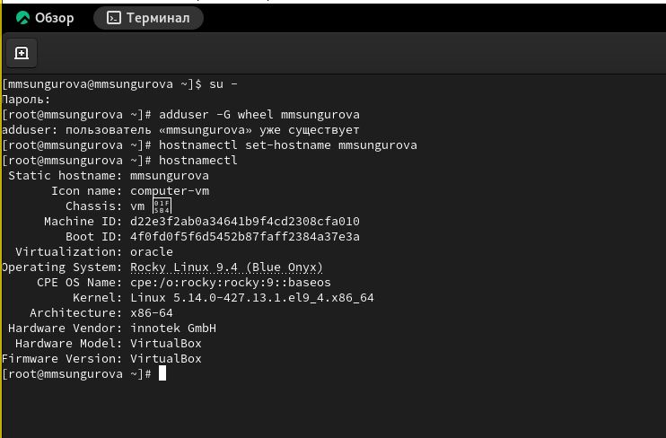{#fig:003 width=70%}

- Также было установлено имя хоста:(рис. [-@fig:003])
`hostnamectl set-hostname mmsungurova`
-Проверка, что имя хоста установлено верно:(рис. [-@fig:003])
`hostnamectl`

## Домашнее задание

В окне терминала проанализируем последовательность загрузки системы, выполнив команду dmesg. Вывод этой команды (рис. [-@fig:004])
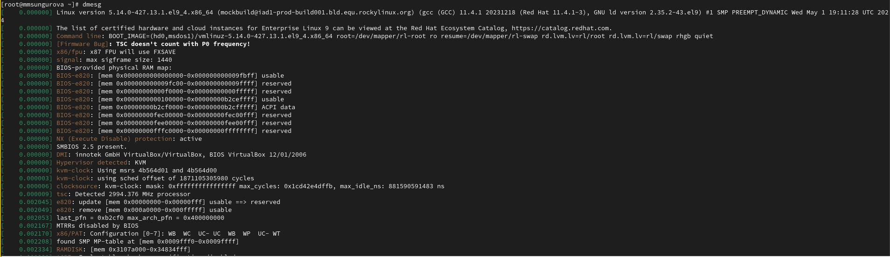{#fig:004 width=30%}

Вывод для dmesg | less (рис. [-@fig:005])
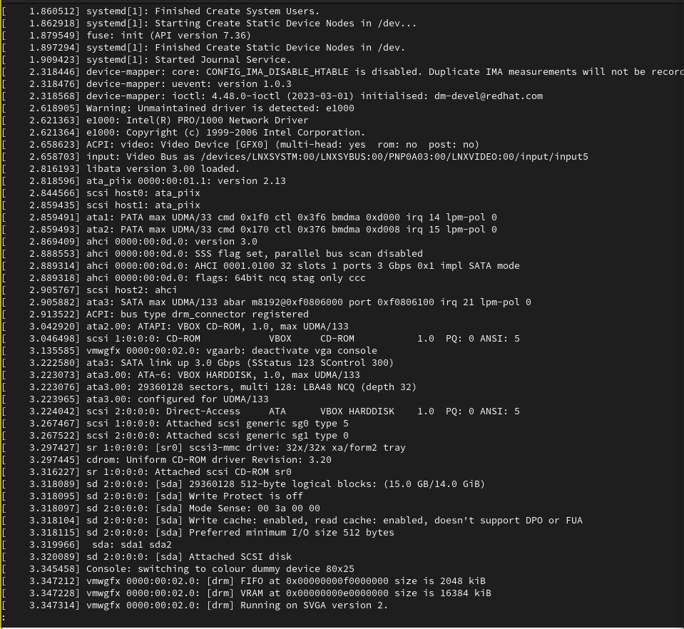{#fig:005 width=30%}

## Домашнее задание

Bспользуемся поиском с помощью grep:
dmesg | grep -i "то, что ищем"
Чтобы получить информацию о:
1. Версия ядра Linux (Linux version)(рис. [-@fig:006])
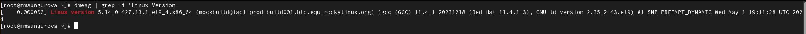{#fig:006 width=70%}

## Домашнее задание
2. Частота процессора (Detected Mhz processor)(рис. [-@fig:007])
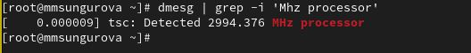{#fig:007 width=70%}

## Домашнее задание  

3. Модель процессора (CPU0)(рис. [-@fig:008])
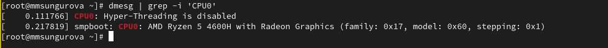{#fig:008 width=70%}

## Домашнее задание

4. Объем доступной оперативной памяти (Memory available)(рис. [-@fig:009])
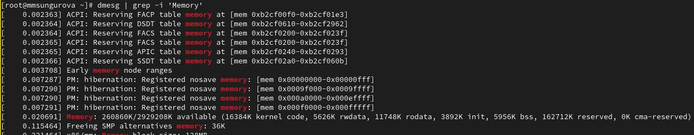{#fig:009 width=70%}

## Домашнее задание

5. Тип обнаруженного гипервизора (Hypervisor detected)(рис. [-@fig:010])
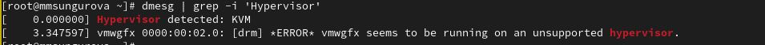{#fig:010 width=70%}

## Домашнее задание

6. Тип файловой системы корневого раздела(рис. [-@fig:011])
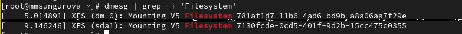{#fig:011 width=70%}

## Домашнее задание

7. Последовательность монтирования файловых систем(рис. [-@fig:012])
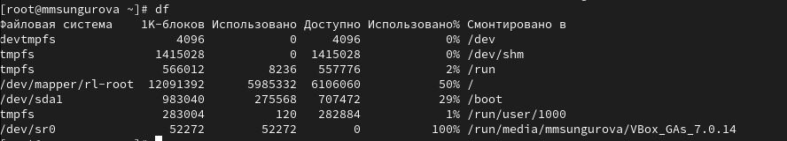{#fig:012 width=70%}

## Контрольные вопросы

Учётная запись пользователя содержит информацию, необходимую для идентификации и аутентификации пользователя при входе в систему. Она может включать следующую информацию:

- Имя пользователя (логин)
- Пароль
- Роль пользователя (например, администратор, обычный пользователь)
- Разрешения и права доступа пользователя к файлам и ресурсам системы
- Домашний каталог пользователя
- Информацию о группе, к которой принадлежит пользователь
- Дополнительные настройки и параметры учётной записи

## Контрольные вопросы

2. Укажите команды терминала и приведите примеры:
- для получения справки по команде;
- для перемещения по файловой системе;
- для просмотра содержимого каталога;
- для определения объёма каталога;
- для создания / удаления каталогов / файлов;
- для задания определённых прав на файл / каталог;
- для просмотра истории команд.

## Контрольные вопросы

- Для получения справки по команде используется команда man. Например, чтобы получить справку по команде ls, нужно выполнить man ls.
- Для перемещения по файловой системе используется команда cd. Например, чтобы перейти в домашний каталог пользователя, нужно выполнить cd ~.
- Для просмотра содержимого каталога используется команда ls. Например, чтобы просмотреть содержимое текущего каталога, нужно выполнить ls.
- Для определения объёма каталога можно использовать команду du. Например, чтобы узнать размер каталога /home/user, нужно выполнить du -sh /home/user.
- Для создания каталога используется команда mkdir. Например, чтобы создать каталог с именем new_directory, нужно выполнить mkdir new_directory.
- Для удаления каталога или файла используется команда rm. Например, чтобы удалить каталог directory, нужно выполнить rm -r directory.
- Для задания определённых прав на файл или каталог используется команда chmod. Например, чтобы задать права чтения, записи и выполнения для владельца файла file.txt, нужно выполнить chmod u+rwx file.txt.
- Для просмотра истории команд используется команда history. Например, чтобы просмотреть последние 10 выполненных команд, нужно выполнить history 10.

## Контрольные вопросы

3. Что такое файловая система? Приведите примеры с краткой характери-
стикой.

Файловая система - это способ организации и хранения файлов на компьютере или другом устройстве. Она определяет структуру и формат файлов, а также правила доступа к ним. Файловая система позволяет пользователю организовывать файлы в каталоги и выполнять операции с ними, такие как чтение, запись и удаление. Примеры файловых систем:

- FAT32: это файловая система, которая широко используется на съемных носителях, таких как флеш-накопители и SD-карты. Она поддерживает файлы размером до 4 ГБ и имеет ограничения на длину имени файла и пути.
- NTFS: это файловая система, которая используется в операционных системах Windows. Она поддерживает большие файлы и имеет расширенные функции безопасности и управления правами доступа.
- ext4: это файловая система, которая широко используется в операционных системах Linux. Она обеспечивает высокую производительность и надежность, поддерживает большие файлы и имеет расширенные функции, такие как журналирование.
- APFS: это файловая система, разработанная Apple для операционных систем macOS, iOS, watchOS и tvOS. Она обеспечивает высокую производительность, эффективное использование пространства и надежность.

## Контрольные вопросы

4. Как посмотреть, какие файловые системы подмонтированы в ОС?

Чтобы узнать, какие файловые системы подмонтированы в операционной системе, вы можете использовать команду `df`. Она позволяет отобразить информацию о доступном месте на файловых системах.

## Контрольные вопросы

5. Как удалить зависший процесс?

Для удаления процесса с помощью команды `ps` надо найти PID процесса(`ps -ef | grep <название_процесса>`), а затем выполнить команду `kill <PID>`.

# Выводы

## Выводы

В результате выполнения работы были приобретены практические навыки установки операционной системы на виртуальную машину, настройки минимально необходимых для дальнейшей работы сервисов.

