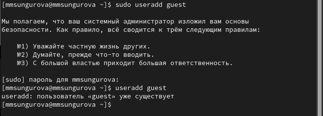
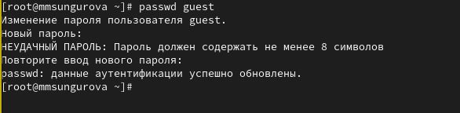
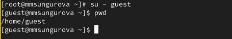
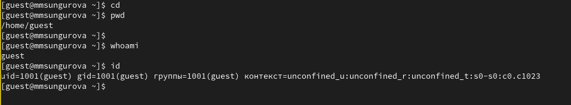
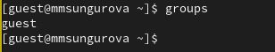
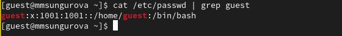
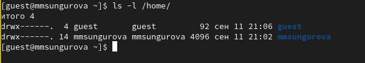
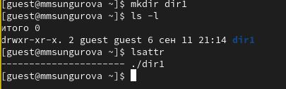
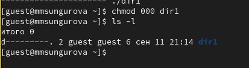
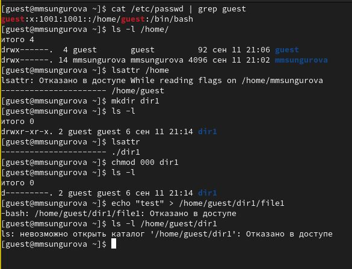

---
## Front matter
lang: ru-RU
title: Основы информационной безопасности. Лабораторная работа №2
subtitle: Дискреционное разграничение прав в Linux. Основные атрибуты
author:
  - Сунгурова М.М.
institute:
  - Российский университет дружбы народов, Москва, Россия
date: 12 сентября 2024

## i18n babel
babel-lang: russian
babel-otherlangs: english

## Formatting pdf
toc: false
toc-title: Содержание
slide_level: 2
aspectratio: 169
section-titles: true
theme: metropolis
header-includes:
 - \metroset{progressbar=frametitle,sectionpage=progressbar,numbering=fraction}
 - '\makeatletter'
 - '\beamer@ignorenonframefalse'
 - '\makeatother'
---

# Информация

## Докладчик

:::::::::::::: {.columns align=center}
::: {.column width="70%"}

  * Сунгурова Мариян Мухсиновна
  * НКНбд-01-21
  * Российский университет дружбы народов

:::
::: {.column width="30%"}

:::
::::::::::::::

# Вводная часть

## Цели и задачи

Получение практических навыков работы в консоли с атрибутами файлов, закрепление теоретических основ дискреционного разграничения доступа в современных системах с открытым кодом на базе ОС Linux.

## Теоретическое введение

При работе с командой chmod важно понимать основные права доступа, которые назначают файлам или каталогам. В Linux используется три основных типа прав доступа:

  - Чтение (Read) — обозначается буквой «r». Предоставляет возможность просматривать содержимое файла или каталога.
  - Запись (Write) — обозначается буквой «w». Позволяет создавать, изменять и удалять файлы внутри каталога, а также изменять содержимое файла.
  - Выполнение (Execute) — обозначается буквой «x». Дает разрешение на выполнение файла или на вход в каталог.

## Теоретическое введение

Каждый из указанных выше типов прав доступа может быть назначен трем группам пользователей:

  - Владелец (Owner) — пользователь, который является владельцем файла или каталога.
  - Группа (Group) — группа пользователей, к которой принадлежит файл или каталог.
  - Остальные пользователи (Others) — все остальные пользователи системы.

Комбинация этих базовых прав доступа для каждой из групп пользователей определяет полный набор прав доступа для файла или каталога.

# Выполнение лабораторной работы

## Создание нового пользователя

В установленной при выполнении предыдущей лабораторной работы ОС создадим учетную запись ползователя guest, и установим пароль пользователя guest

{#fig:001 width=40%}

{#fig:002 width=40%}

## Создание нового пользователя

- Войдем в систему от имени пользователя guest. Определим директорию, в которой мы находимся, командой `pwd`. Сравнив её с приглашением командной строки, увидим, что она называется как наш пользователь. Она является домашней директорией. 

{#fig:003 width=50%}

## Создание нового пользователя

Уточним им нашего пользователя командой `whoami`. С помощью команды id также увидим имя пользователя и его id 1001 и группу guest с id 1001.

{#fig:004 width=50%}

## Создание нового пользователя

Сравнивая вывод id с выводом команды groups, можно увидеть, что пользователь входит только в одну группу(в этом случае указывается только ее название). 

{#fig:005 width=50%}

## Создание нового пользователя

Посмотрим файл /etc/passwd командой `cat /etc/passwd` и увидим, что uid и gid пользователя равен 1001, что также было видно из предыдщих выводов команд.

{#fig:006 width=50%}

## Создание нового пользователя

Определим существующие в системе директории командой `ls -l /home/` -это guest и mmsungurova, правами на чтение, запись и изменение директорий владеет только их владелец.

{#fig:007 width=50%}

## Создание нового пользователя

Также с помощью команды lsattr увидим, что для домашней директории не установлены расширенные атрибуты, а для других пользователей мы не можем это просмотреть. 

## Создание нового пользователя

Создадим в домашней директории поддиректорию dir1 командой `mkdir dir1`. Затем, вопользуемся командами ls -l и lsattr. Увидим, что для владельца этой директории есть все права, а для группы и остальных доступно только чтение и вход(не доступно внесение изменений), также видно, что никаких расщиренных атрибутов не установлено.

{#fig:008 width=50%}

## Создание нового пользователя

Затем снимем с директории dir1 все атрибуты командой `chmod 000 dir1` и проверим выполнение с помощью команды `ls -l`. 

{#fig:009 width=50%}

## Создание нового пользователя

- Также попытаемся создать в директории dir1 файл file1 командой `echo "test" > /home/guest/dir1/file1` 
-mОднако, так как мы забрали право на запись в эту директорию, то получим отказ в создании. А введя команду `ls -l /home/guest/dir1` увидим, что просмотр директории также запрещен(рис. @fig:010).

{#fig:010 width=50%}

## Права директорий и файлов

Заполним таблицу №1 данными о том, какие операции разрешены, а какие нет для владельца данных.

## Права директорий и файлов

На основании заполненной ранее таблицы №1 определим минимально необходимые права для выполнения операций внутри директории, заполним таблицу №2

## Минимальные права для совершения операций

| Операция | Минимальные правана директорию | Минимальные права на файл |
|----------|---------------------------------|---------------------------|
|Создание файла|            d(300)               |               (000)            |
|Удаление файла|            d(300)               |               (000)            |
|Чтение файла|            d(100)               |               (400)            |

## Минимальные права для совершения операций

| Операция | Минимальные правана директорию | Минимальные права на файл |
|----------|---------------------------------|---------------------------|
|Запись в файл|            d(100)               |               (200)            |
|Переименование файла |            d(300)               |               (000)            |
|Создание поддиректории |            d(300)               |               (000)            |
|Удаление поддиректории |            d(300)               |               (000)            |

# Выводы

## Выводы

В результате выполнения данной лабораторной работы были получены практические навыки работы в консоли с атрибутами файлов, закреплены теоретические основы дискреционного разграничения доступа в современных системах с открытым кодом на базе ОС Linux.