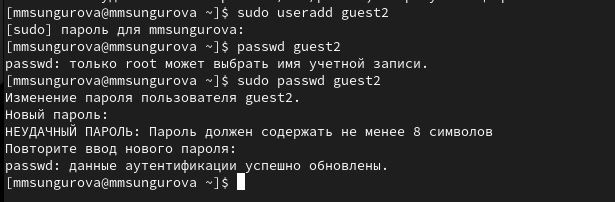
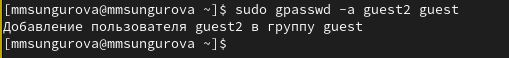
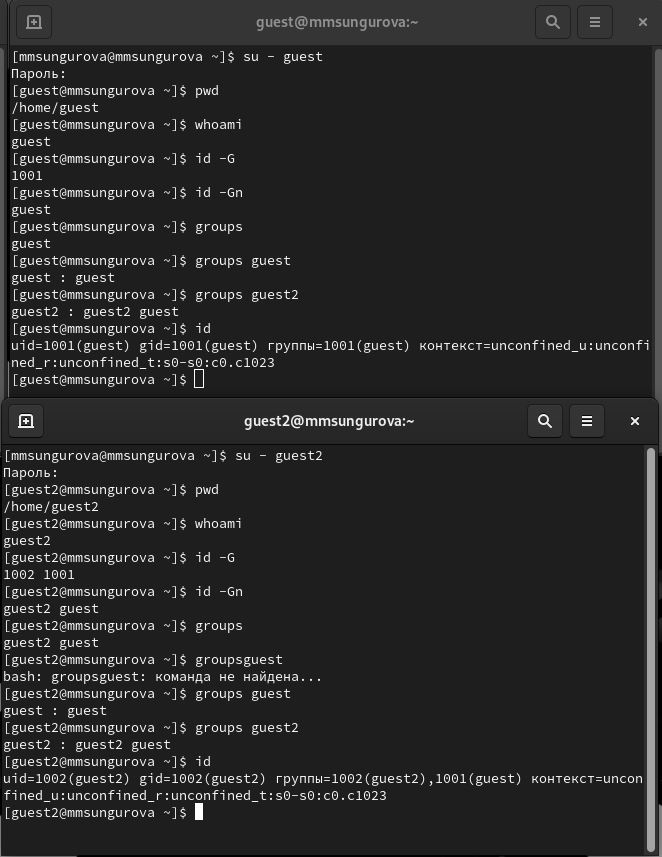
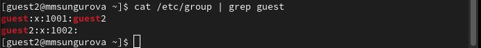
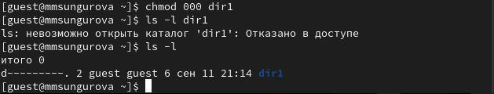

---
## Front matter
lang: ru-RU
title: "Основы информационной безопасности"
subtitle: "Лабораторная работа № 3. Дискреционное разграничение прав в Linux. Два пользователя"
author: 
  - "Сунгурова Мариян Мухсиновна"
institute:
  - Российский университет дружбы народов, Москва, Россия
date: 21 сентября 2024

## i18n babel
babel-lang: russian
babel-otherlangs: english

## Formatting pdf
toc: false
toc-title: Содержание
slide_level: 2
aspectratio: 169
section-titles: true
theme: metropolis
header-includes:
 - \metroset{progressbar=frametitle,sectionpage=progressbar,numbering=fraction}
 - '\makeatletter'
 - '\beamer@ignorenonframefalse'
 - '\makeatother'
---

# Информация

## Докладчик

:::::::::::::: {.columns align=center}
::: {.column width="70%"}

  * Сунгкрова Мариян М.
  * Студентка группы НКНбд-01-21

:::
::: {.column width="30%"}

:::
::::::::::::::

# Вводная часть

## Цель работы

Получение практических навыков работы в консоли с атрибутами файлов для групп пользователей.

## Теоретическое введение

При работе с командой chmod важно понимать основные права доступа, которые назначают файлам или каталогам. В Linux используется три основных типа прав доступа:

  - Чтение (Read) — обозначается буквой «r». Предоставляет возможность просматривать содержимое файла или каталога.
  - Запись (Write) — обозначается буквой «w». Позволяет создавать, изменять и удалять файлы внутри каталога, а также изменять содержимое файла.
  - Выполнение (Execute) — обозначается буквой «x». Дает разрешение на выполнение файла или на вход в каталог.

## Теоретическое введение

Каждый из указанных выше типов прав доступа может быть назначен трем группам пользователей:

  - Владелец (Owner) — пользователь, который является владельцем файла или каталога.
  - Группа (Group) — группа пользователей, к которой принадлежит файл или каталог.
  - Остальные пользователи (Others) — все остальные пользователи системы.

Комбинация этих базовых прав доступа для каждой из групп пользователей определяет полный набор прав доступа для файла или каталога.

# Выполнение лабораторной работы

## Выполнение лабораторной работы

1. В установленной при выполнении предыдущей лабораторной работы ОС создадим учетную запись ползователя guest2 и добавляем его в группу guest (рис. @fig:001 -- @fig:002)

{#fig:001 width=40%}

{#fig:002 width=40%}

## Выполнение лабораторной работы

2. Осуществим вход в систему от двух пользователей на двух разных консолях: guest на первой консоли и guest2 на второй консоли. Далее для обоих пользователей командой pwd определим директорию, в которой находимся.  Увидим, что она совпадает с приглашениями командной строки. Увидим, что guest принадлежит одной группе guet c ig 2001, а двум группам guest и guest2 с id 1001 и 1002. С помощью команд id -Gn и id -G можно увидеть только id существующиз групп и название соответственно

## Выполнение лабораторной работы

3. Уточним имя пользователя, его группу, кто входит в неё и к каким группам принадлежит он сам. Определите командами `groups guest` и `groups guest2`, в какие группы входят пользователи guest и guest2. Увидим, что guest принадлежит одной группе guet c ig 2001, а двум группам guest и guest2 с id 1001 и 1002. С помощью команд id -Gn и id -G можно увидеть только id существующиз групп и название соответственно (рис. @fig:003)
   
{#fig:003 width=40%}

## Выполнение лабораторной работы

4. Сравним полученную информацию с содержимым файла /etc/group, просмотрев файл командой  `cat /etc/group`

{#fig:004 width=70%}

## Выполнение лабораторной работы

5. От имени пользователя guest2 выполним регистрацию пользователя guest2 в группе guest командой
`newgrp guest` 

{#fig:005 width=70%}

## Выполнение лабораторной работы

6. От имени пользователя guest изменим права директории /home/guest, разрешив все действия для пользователей группы: `chmod g+rwx /home/guest`

{#fig:006 width=70%}

## Выполнение лабораторной работы

В табл. 1 в отчете приведены данные о том, какие операции разрешены, а какие нет для владельца данных.

В табл. [-@tbl:tbl2] приведены данные о том, какие минимальные права должны быть для совершения различных действий.

## Выполнение лабораторной работы

: Минимальные права для совершения операций {#tbl:tbl2}

| Операция | Минимальные права на директорию | Минимальные права на файл |
|-----------------------|------------|-----------|
|Создание файла|            d(030)               |               (000)            |
|Удаление файла|            d(030)               |               (000)            |
|Чтение файла|            d(010)               |               (040)            |
|Запись в файл|            d(010)               |               (020)            |
|Переименование файла |            d(030)               |               (000)            |
|Создание поддиректории |            d(030)               |               (000)            |
|Удаление поддиректории |            d(030)               |               (000)            |

## Выполнение лабораторной работы

При сравнении с таблицей в лабораторной работе №2 можно увидеть, что отличие состоит только в том, что не владелец файла никогда не имеет прав на изменение его атрибутов. Менять права может владелец файла или администратор. Члены группы файла никаких особых прав на inode не имеют. Пользователь может отобрать у себя собственные права на чтение и запись в файл, но право на запись в inode (в т.ч. право на смену прав) сохраняется у владельца файла при любых обстоятельствах. Пользователь не может передать право собственности на файл другому пользователю и не может забрать право собственности на файл у другого пользователя.

# Выводы

## Выводы

В результате выполнения даной лабораторной работы были получены практические навыки работы в консоли с атрибутами файлов для групп пользователей.

