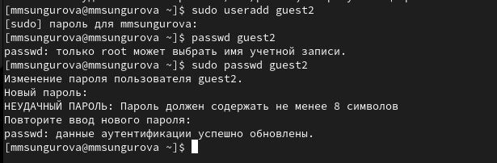
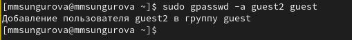
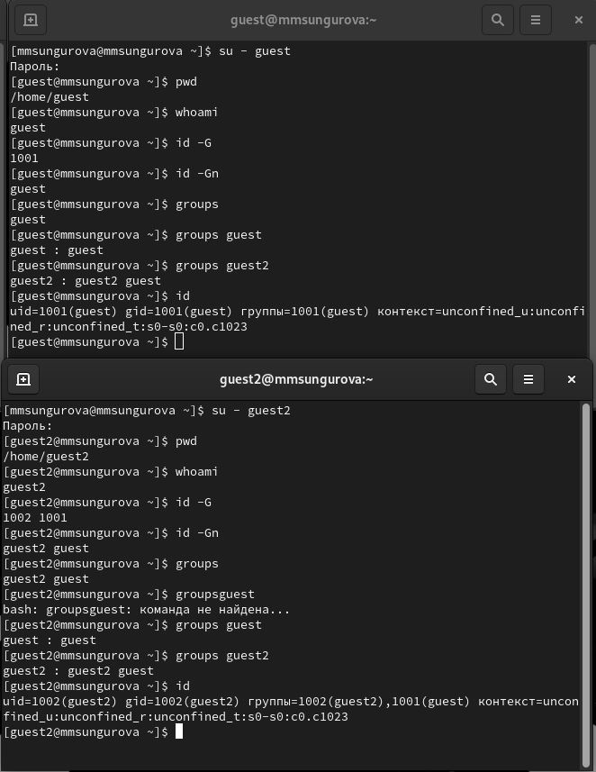
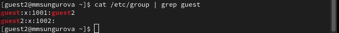
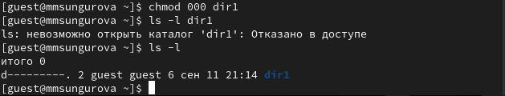

---
## Front matter
title: "Основы информационной безопасности"
subtitle: "Лабораторная работа № 3. Дискреционное разграничение прав в Linux. Два пользователя"
author: "Сунгурова Мариян Мухсиновна"

## Generic otions
lang: ru-RU
toc-title: "Содержание"

## Bibliography
bibliography: bib/cite.bib
csl: pandoc/csl/gost-r-7-0-5-2008-numeric.csl

## Pdf output format
toc: true # Table of contents
toc-depth: 2
lof: true # List of figures
lot: true # List of tables
fontsize: 12pt
linestretch: 1.5
papersize: a4
documentclass: scrreprt
## I18n polyglossia
polyglossia-lang:
  name: russian
  options:
	- spelling=modern
	- babelshorthands=true
polyglossia-otherlangs:
  name: english
## I18n babel
babel-lang: russian
babel-otherlangs: english
## Fonts
mainfont: PT Serif
romanfont: PT Serif
sansfont: PT Sans
monofont: PT Mono
mainfontoptions: Ligatures=TeX
romanfontoptions: Ligatures=TeX
sansfontoptions: Ligatures=TeX,Scale=MatchLowercase
monofontoptions: Scale=MatchLowercase,Scale=0.9
## Biblatex
biblatex: true
biblio-style: "gost-numeric"
biblatexoptions:
  - parentracker=true
  - backend=biber
  - hyperref=auto
  - language=auto
  - autolang=other*
  - citestyle=gost-numeric
## Pandoc-crossref LaTeX customization
figureTitle: "Рис."
tableTitle: "Таблица"
listingTitle: "Листинг"
lofTitle: "Список иллюстраций"
lotTitle: "Список таблиц"
lolTitle: "Листинги"
## Misc options
indent: true
header-includes:
  - \usepackage{indentfirst}
  - \usepackage{float} # keep figures where there are in the text
  - \floatplacement{figure}{H} # keep figures where there are in the text
---

# Цель работы

Получение практических навыков работы в консоли с атрибутами файлов для групп пользователей.

# Теоретическое введение

При работе с командой chmod важно понимать основные права доступа, которые назначают файлам или каталогам. В Linux используется три основных типа прав доступа[@scott_linux_2019]:

  - Чтение (Read) — обозначается буквой «r». Предоставляет возможность просматривать содержимое файла или каталога.
  - Запись (Write) — обозначается буквой «w». Позволяет создавать, изменять и удалять файлы внутри каталога, а также изменять содержимое файла.
  - Выполнение (Execute) — обозначается буквой «x». Дает разрешение на выполнение файла или на вход в каталог.

Каждый из указанных выше типов прав доступа может быть назначен трем группам пользователей:

  - Владелец (Owner) — пользователь, который является владельцем файла или каталога.
  - Группа (Group) — группа пользователей, к которой принадлежит файл или каталог.
  - Остальные пользователи (Others) — все остальные пользователи системы.

Комбинация этих базовых прав доступа для каждой из групп пользователей определяет полный набор прав доступа для файла или каталога.

# Выполнение лабораторной работы

1. В установленной при выполнении предыдущей лабораторной работы ОС создадим учетную запись ползователя guest2 и добавляем его в группу guest (рис. @fig:001 -- @fig:002)

{#fig:001 width=70%}

{#fig:002 width=70%}

1. Осуществим вход в систему от двух пользователей на двух разных консолях: guest на первой консоли и guest2 на второй консоли. Далее для обоих пользователей командой pwd определим директорию, в которой находимся.  Увидим, что она совпадает с приглашениями командной строки. Увидим, что guest принадлежит одной группе guet c ig 2001, а двум группам guest и guest2 с id 1001 и 1002. С помощью команд id -Gn и id -G можно увидеть только id существующиз групп и название соответственно

2. Уточним имя пользователя, его группу, кто входит в неё и к каким группам принадлежит он сам. Определите командами `groups guest` и `groups guest2`, в какие группы входят пользователи guest и guest2. Увидим, что guest принадлежит одной группе guet c ig 2001, а двум группам guest и guest2 с id 1001 и 1002. С помощью команд id -Gn и id -G можно увидеть только id существующиз групп и название соответственно (рис. @fig:003)
   
{#fig:003 width=70%}

3. Сравним полученную информацию с содержимым файла /etc/group, просмотрев файл командой  `cat /etc/group`

{#fig:004 width=70%}

4. От имени пользователя guest2 выполним регистрацию пользователя guest2 в группе guest командой
`newgrp guest` 

{#fig:005 width=70%}

5. От имени пользователя guest изменим права директории /home/guest, разрешив все действия для пользователей группы: `chmod g+rwx /home/guest`

{#fig:006 width=70%}

В табл. [-@tbl:tbl1] приведены данные о том, какие операции разрешены, а какие нет для владельца данных.

: Установленные права и разрешённые действия {#tbl:tbl1}

| Права директории | Права файла | Создание файла | Удаление файла | Запись в файл | Чтение файла | Смена директории | Просмотр файлов в директории | Переименование файла | Смена атрибутов файла |
|------------|-----------|---------|---------|---------|---------|---------|---------|---------|---------|
|   d(000)   |   (000)   |    -    |    -    |    -    |    -    |    -    |    -    |    -    |    -    |
|   d(010)   |   (000)   |    -    |    -    |    -    |    -    |    +    |    -    |    -    |    -    |
|   d(020)   |   (000)   |    -    |    -    |    -    |    -    |    -    |    -    |    -    |    -    |
|   d(030)   |   (000)   |    +    |    +    |    -    |    -    |    +    |    -    |    +    |    -    |
|   d(040)   |   (000)   |    -    |    -    |    -    |    -    |    -    |    +    |    -    |    -    |
|   d(050)   |   (000)   |    -    |    -    |    -    |    -    |    +    |    +    |    -    |    -    |
|   d(060)   |   (000)   |    -    |    -    |    -    |    -    |    -    |    +    |    -    |    -    |
|   d(070)   |   (000)   |    +    |    +    |    -    |    -    |    +    |    +    |    +    |    -    |
|   d(000)   |   (010)   |    -    |    -    |    -    |    -    |    -    |    -    |    -    |    -    |
|   d(010)   |   (010)   |    -    |    -    |    -    |    -    |    +    |    -    |    -    |    -    |
|   d(020)   |   (010)   |    -    |    -    |    -    |    -    |    -    |    -    |    -    |    -    |
|   d(030)   |   (010)   |    +    |    +    |    -    |    -    |    +    |    -    |    +    |    -    |
|   d(040)   |   (010)   |    -    |    -    |    -    |    -    |    -    |    +    |    -    |    -    |
|   d(050)   |   (010)   |    -    |    -    |    -    |    -    |    +    |    +    |    -    |    -    |
|   d(060)   |   (010)   |    -    |    -    |    -    |    -    |    -    |    +    |    -    |    -    |
|   d(070)   |   (010)   |    +    |    +    |    -    |    -    |    +    |    +    |    +    |    -    |
|   d(000)   |   (020)   |    -    |    -    |    -    |    -    |    -    |    -    |    -    |    -    |
|   d(010)   |   (020)   |    -    |    -    |    +    |    -    |    +    |    -    |    -    |    -    |
|   d(020)   |   (020)   |    -    |    -    |    -    |    -    |    -    |    -    |    -    |    -    |
|   d(030)   |   (020)   |    +    |    +    |    +    |    -    |    +    |    -    |    +    |    -    |
|   d(040)   |   (020)   |    -    |    -    |    -    |    -    |    -    |    +    |    -    |    -    |
|   d(050)   |   (020)   |    -    |    -    |    +    |    -    |    +    |    +    |    -    |    -    |
|   d(060)   |   (020)   |    -    |    -    |    -    |    -    |    -    |    +    |    -    |    -    |
|   d(070)   |   (020)   |    +    |    +    |    +    |    -    |    +    |    +    |    +    |    -    |
|   d(000)   |   (030)   |    -    |    -    |    -    |    -    |    -    |    -    |    -    |    -    |
|   d(010)   |   (030)   |    -    |    -    |    +    |    -    |    +    |    -    |    -    |    -    |
|   d(020)   |   (030)   |    -    |    -    |    -    |    -    |    -    |    -    |    -    |    -    |
|   d(030)   |   (030)   |    +    |    +    |    +    |    -    |    +    |    -    |    +    |    -    |
|   d(040)   |   (030)   |    -    |    -    |    -    |    -    |    -    |    +    |    -    |    -    |
|   d(050)   |   (030)   |    -    |    -    |    +    |    -    |    +    |    +    |    -    |    -    |
|   d(060)   |   (030)   |    -    |    -    |    -    |    -    |    -    |    +    |    -    |    -    |
|   d(070)   |   (030)   |    +    |    +    |    +    |    -    |    +    |    +    |    +    |    -    |
|   d(000)   |   (040)   |    -    |    -    |    -    |    -    |    -    |    -    |    -    |    -    |
|   d(010)   |   (040)   |    -    |    -    |    -    |    +    |    +    |    -    |    -    |    -    |
|   d(020)   |   (040)   |    -    |    -    |    -    |    -    |    -    |    -    |    -    |    -    |
|   d(030)   |   (040)   |    +    |    +    |    -    |    +    |    +    |    -    |    +    |    -    |
|   d(040)   |   (040)   |    -    |    -    |    -    |    -    |    -    |    +    |    -    |    -    |
|   d(050)   |   (040)   |    -    |    -    |    -    |    +    |    +    |    +    |    -    |    -    |
|   d(060)   |   (040)   |    -    |    -    |    -    |    -    |    -    |    +    |    -    |    -    |
|   d(070)   |   (040)   |    +    |    +    |    -    |    +    |    +    |    +    |    +    |    -    |
|   d(000)   |   (050)   |    -    |    -    |    -    |    -    |    -    |    -    |    -    |    -    |
|   d(010)   |   (050)   |    -    |    -    |    -    |    +    |    +    |    -    |    -    |    -    |
|   d(020)   |   (050)   |    -    |    -    |    -    |    -    |    -    |    -    |    -    |    -    |
|   d(030)   |   (050)   |    +    |    +    |    -    |    +    |    +    |    -    |    +    |    -    |
|   d(040)   |   (050)   |    -    |    -    |    -    |    -    |    -    |    +    |    -    |    -    |
|   d(050)   |   (050)   |    -    |    -    |    -    |    +    |    +    |    +    |    -    |    -    |
|   d(060)   |   (050)   |    -    |    -    |    -    |    -    |    -    |    +    |    -    |    -    |
|   d(070)   |   (050)   |    +    |    +    |    -    |    +    |    +    |    +    |    +    |    -    |
|   d(000)   |   (060)   |    -    |    -    |    -    |    -    |    -    |    -    |    -    |    -    |
|   d(010)   |   (060)   |    -    |    -    |    +    |    +    |    +    |    -    |    -    |    -    |
|   d(020)   |   (060)   |    -    |    -    |    -    |    -    |    -    |    -    |    -    |    -    |
|   d(030)   |   (060)   |    +    |    +    |    +    |    +    |    +    |    -    |    +    |    -    |
|   d(040)   |   (060)   |    -    |    -    |    -    |    -    |    -    |    +    |    -    |    -    |
|   d(050)   |   (060)   |    -    |    -    |    +    |    +    |    +    |    +    |    -    |    -    |
|   d(060)   |   (060)   |    -    |    -    |    -    |    -    |    -    |    +    |    -    |    -    |
|   d(070)   |   (060)   |    +    |    +    |    +    |    +    |    +    |    +    |    +    |    -    |
|   d(000)   |   (070)   |    -    |    -    |    -    |    -    |    -    |    -    |    -    |    -    |
|   d(010)   |   (070)   |    -    |    -    |    +    |    +    |    +    |    -    |    -    |    -    |
|   d(020)   |   (070)   |    -    |    -    |    -    |    -    |    -    |    -    |    -    |    -    |
|   d(030)   |   (070)   |    +    |    +    |    +    |    +    |    +    |    -    |    +    |    -    |
|   d(040)   |   (070)   |    -    |    -    |    -    |    -    |    -    |    +    |    -    |    -    |
|   d(050)   |   (070)   |    -    |    -    |    +    |    +    |    +    |    +    |    -    |    -    |
|   d(060)   |   (070)   |    -    |    -    |    -    |    -    |    -    |    +    |    -    |    -    |
|   d(070)   |   (070)   |    +    |    +    |    +    |    +    |    +    |    +    |    +    |    -    |

В табл. [-@tbl:tbl2] приведены данные о том, какие минимальные права должны быть для совершения различных действий.

: Минимальные права для совершения операций {#tbl:tbl2}

| Операция | Минимальные права на директорию | Минимальные права на файл |
|-----------------------|------------|-----------|
|Создание файла|            d(030)               |               (000)            |
|Удаление файла|            d(030)               |               (000)            |
|Чтение файла|            d(010)               |               (040)            |
|Запись в файл|            d(010)               |               (020)            |
|Переименование файла |            d(030)               |               (000)            |
|Создание поддиректории |            d(030)               |               (000)            |
|Удаление поддиректории |            d(030)               |               (000)            |

При сравнении с таблицей в лабораторной работе №2 можно увидеть, что отличие состоит только в том, что не владелец файла никогда не имеет прав на изменение его атрибутов. Менять права может владелец файла или администратор[@uran2020]. Члены группы файла никаких особых прав на inode не имеют. Пользователь может отобрать у себя собственные права на чтение и запись в файл, но право на запись в inode (в т.ч. право на смену прав) сохраняется у владельца файла при любых обстоятельствах. Пользователь не может передать право собственности на файл другому пользователю и не может забрать право собственности на файл у другого пользователя.

# Выводы

В результате выполнения даной лабораторной работы были получены практические навыки работы в консоли с атрибутами файлов для групп пользователей.

# Список литературы{.unnumbered}

::: {#refs}
:::
