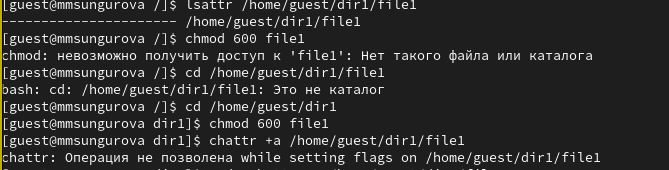
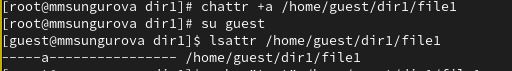
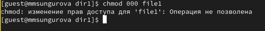

---
## Front matter
lang: ru-RU
title:  Основы информационной безопасности. Лабораторная работа №4
subtitle: Дискреционное разграничение прав в Linux. Расширенные атрибуты
author: |
	Сунгурова М. М.
institute: Российский Университет дружбы народов
date: 09.09.2023

## i18n babel
babel-lang: russian
babel-otherlangs: english

## Formatting pdf
toc: false
toc-title: Содержание
slide_level: 2
aspectratio: 169
section-titles: true
theme: metropolis
header-includes:
 - \metroset{progressbar=frametitle,sectionpage=progressbar,numbering=fraction}
 - '\makeatletter'
 - '\beamer@ignorenonframefalse'
 - '\makeatother'
---

# Информация

## Докладчик

:::::::::::::: {.columns align=center}
::: {.column width="70%"}

  * Сунгурова Мариян Мухсиновна
  * студентка группы НКНбд-01-21
  * Российский университет дружбы народов

:::
::: {.column width="30%"}

:::
::::::::::::::

# Вводная часть

## Цели и задачи

**Целью** данной работы является приобретение практических навыков работы в консоли с расширенными атрибутами файлов.

**Задачи:**

- Изменение расширенных атрибутов прав доступа
- Проверка прав дсотупа при разных расширенных атрибутах

**Инструмент:** VirtualBox, bash

# Выполнение лабораторной работы

## Создание нового пользователся guest2

{#fig:001 width=70%}

## Просмотр информации о группах пользователя

{#fig:002 width=70%}

## Просмотр информации о группах пользователя

{#fig:003 width=40%}

{#fig:013 width=40%}

## Изменение прав доступа

{#fig:004 width=70%}

## Изменение прав доступа

{#fig:005 width=70%}

# Заключение

## Выводы

В результате выполнения работы были приобретены практические навыки работы в консоли с расширенными атрибутами файлов.

## Список литературы

1. Граннеман С. Скотт Граннеман: Linux. Карманный справочник. 2-е изд. Вильямс, 2019. 464 с.