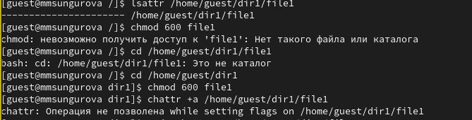
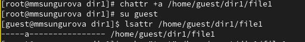

---
## Front matter
title: "Основы информационной безопасности"
subtitle: "Лабораторная работа № 4. Дискреционное разграничение прав в Linux. Расширенные атрибуты"
author: "Сунгурова Мариян"

## Generic otions
lang: ru-RU
toc-title: "Содержание"

## Bibliography
bibliography: bib/cite.bib
csl: pandoc/csl/gost-r-7-0-5-2008-numeric.csl

## Pdf output format
toc: true # Table of contents
toc-depth: 2
lof: true # List of figures
lot: false # List of tables
fontsize: 12pt
linestretch: 1.5
papersize: a4
documentclass: scrreprt
## I18n polyglossia
polyglossia-lang:
  name: russian
  options:
	- spelling=modern
	- babelshorthands=true
polyglossia-otherlangs:
  name: english
## I18n babel
babel-lang: russian
babel-otherlangs: english
## Fonts
mainfont: PT Serif
romanfont: PT Serif
sansfont: PT Sans
monofont: PT Mono
mainfontoptions: Ligatures=TeX
romanfontoptions: Ligatures=TeX
sansfontoptions: Ligatures=TeX,Scale=MatchLowercase
monofontoptions: Scale=MatchLowercase,Scale=0.9
## Biblatex
biblatex: true
biblio-style: "gost-numeric"
biblatexoptions:
  - parentracker=true
  - backend=biber
  - hyperref=auto
  - language=auto
  - autolang=other*
  - citestyle=gost-numeric
## Pandoc-crossref LaTeX customization
figureTitle: "Рис."
tableTitle: "Таблица"
listingTitle: "Листинг"
lofTitle: "Список иллюстраций"
lotTitle: "Список таблиц"
lolTitle: "Листинги"
## Misc options
indent: true
header-includes:
  - \usepackage{indentfirst}
  - \usepackage{float} # keep figures where there are in the text
  - \floatplacement{figure}{H} # keep figures where there are in the text
---

# Цель работы

Получение практических навыков работы в консоли с расширенными атрибутами файлов.

# Теоретические сведения

При работе с командой chmod важно понимать основные права доступа, которые назначают файлам или каталогам. В Linux используется три основных типа прав доступа[@scott_linux_2019]:

  - Чтение (Read) — обозначается буквой «r». Предоставляет возможность просматривать содержимое файла или каталога.
  - Запись (Write) — обозначается буквой «w». Позволяет создавать, изменять и удалять файлы внутри каталога, а также изменять содержимое файла.
  - Выполнение (Execute) — обозначается буквой «x». Дает разрешение на выполнение файла или на вход в каталог.

Каждый из указанных выше типов прав доступа может быть назначен трем группам пользователей:

  - Владелец (Owner) — пользователь, который является владельцем файла или каталога.
  - Группа (Group) — группа пользователей, к которой принадлежит файл или каталог.
  - Остальные пользователи (Others) — все остальные пользователи системы.

Комбинация этих базовых прав доступа для каждой из групп пользователей определяет полный набор прав доступа для файла или каталога.

# Выполнение лабораторной работы

От имени пользователя guest определим расширенные атрибуты файла /home/guest/dir1/file1, в данный момент их нет. Установим командой chmod 600 file1 на файл file1 права, разрешающие чтение и запись для владельца файла. Попробуем установить на файл /home/guest/dir1/file1 расширенный атрибут a от имени пользователя guest. В отчет получим отказ(рис. @fig:001)

{#fig:001 width=70%}

Зайдем на третью консоль с правами администратора и попробуем установить расширенный атрибут a на файл /home/guest/dir1/file1 от имени суперпользователя(рис. @fig:002)

{#fig:002 width=70%}

От пользователя guest проверим правильность установления атрибута. Затем выполним дозапись в файл file1 слова «test» командой, после этого выполним чтение файла file1 командой и убедимся, что слово test было успешно записано в file1. Попробуем удалить файл file1, стереть имеющуюся в нём информацию командой, переименовть файл и изменить его атрибуты -- ничего из этого сделать не удается(рис. @fig:003)
{#fig:010 width=70%}
{#fig:003 width=70%}

Уберем из суперпользователя атрибут a и повторим все действия, которые ранее не удалось совершить(рис. @fig:004).

{#fig:004 width=70%}

Теперь мы имеем права на все эьти действия

{#fig:015 width=70%}

Попробуем повторить всё ещё раз, установив атрибут i(рис. @fig:005).

{#fig:005 width=70%}

Теперь над недоступна в том числе и дозапись в файл, то есть запрещены любые действия с этим файлом.

# Выводы

В результате выполнения работы были приобретены практические навыки работы в консоли с расширенными атрибутами файлов.

# Список литературы{.unnumbered}

::: {#refs}
:::

