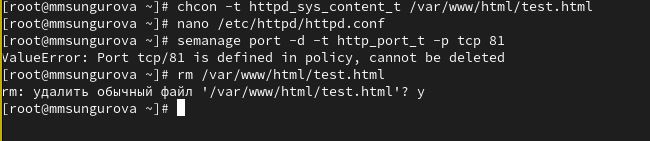

---
## Front matter
title: "Основы информационной безопасности"
subtitle: "Лабораторная работа № 6. Мандатное разграничение прав в Linux"
author: "Сунгурова М."

## Generic otions
lang: ru-RU
toc-title: "Содержание"

## Bibliography
bibliography: bib/cite.bib
csl: pandoc/csl/gost-r-7-0-5-2008-numeric.csl

## Pdf output format
toc: true # Table of contents
toc-depth: 2
lof: true # List of figures
lot: false # List of tables
fontsize: 12pt
linestretch: 1.5
papersize: a4
documentclass: scrreprt
## I18n polyglossia
polyglossia-lang:
  name: russian
  options:
	- spelling=modern
	- babelshorthands=true
polyglossia-otherlangs:
  name: english
## I18n babel
babel-lang: russian
babel-otherlangs: english
## Fonts
mainfont: PT Serif
romanfont: PT Serif
sansfont: PT Sans
monofont: PT Mono
mainfontoptions: Ligatures=TeX
romanfontoptions: Ligatures=TeX
sansfontoptions: Ligatures=TeX,Scale=MatchLowercase
monofontoptions: Scale=MatchLowercase,Scale=0.9
## Biblatex
biblatex: true
biblio-style: "gost-numeric"
biblatexoptions:
  - parentracker=true
  - backend=biber
  - hyperref=auto
  - language=auto
  - autolang=other*
  - citestyle=gost-numeric
## Pandoc-crossref LaTeX customization
figureTitle: "Рис."
tableTitle: "Таблица"
listingTitle: "Листинг"
lofTitle: "Список иллюстраций"
lotTitle: "Список таблиц"
lolTitle: "Листинги"
## Misc options
indent: true
header-includes:
  - \usepackage{indentfirst}
  - \usepackage{float} # keep figures where there are in the text
  - \floatplacement{figure}{H} # keep figures where there are in the text
---

# Цель работы

Целью данной работы является приобретение практических навыков администрирования ОС Linux. Получить первое практическое знакомство с технологией SELinux. Проверить работу SELinx на практике совместно с веб-сервером Apache.

# Теоретические сведения

SELinux (SELinux) — это система принудительного контроля доступа, реализованная на уровне ядра. Впервые эта система появилась в четвертой версии CentOS, а в 5 и 6 версии реализация была существенно дополнена и улучшена. Эти улучшения позволили SELinux стать универсальной системой, способной эффективно решать массу актуальных задач. Стоит помнить, что классическая система прав Unix применяется первой, и управление перейдет к SELinux только в том случае, если эта первичная проверка будет успешно пройдена.

Домен -- список действий, которые может выполнять процесс. Обычно в качестве домена определяется минимально-возможный набор действий, при помощи которых процесс способен функционировать. Таким образом, если процесс дискредитирован, злоумышленнику не удастся нанести большого вреда.

Роль -- список доменов, которые могут быть применены. Если какого-то домена нет в списке доменов какой-то роли, то действия из этого домена не могут быть применены.

Тип -- набор действий, которые допустимы по отношения к объекту. Тип отличается от домена тем, что он может применяться к пайпам, каталогам и файлам, в то время как домен применяется к процессам.

Контекст безопасности -- все атрибуты SELinux — роли, типы и домены.

# Выполнение лабораторной работы

В конфигурационном файле /etc/httpd/httpd.conf зададим параметр ServerName. Также необходимо проследить, чтобы пакетный фильтр был отключён или в своей рабочей конфигурации позволял подключаться к 80-у и 81-у портам протокола tcp. Отключим фильтр командами(рис. @fig:001)

{#fig:001 width=70%}

Войдем в систему с полученными учётными данными и убедимся, что SELinux работает в режиме enforcing политики targeted с помощью команд getenforce и sestatus(рис. @fig:002).

{#fig:002 width=70%}

Обратимся с помощью браузера к веб-серверу, запущенному на нашем компьютере, и убедитесь, что последний работает(рис. @fig:002).

Найдите веб-сервер Apache в списке процессов, определим его контекст безопасности(рис. @fig:002)

Мы можем видеть контекст безопасности SELinux: system_u:system_r:httpd_t.

Также просмотрим множество пользователей, ролей, типов(рис. @fig:007):

{#fig:007 width=70%}

Определив тип файлов и поддиректорий, находящихся в директории /var/www, с помощью команды ls -lZ /var/www, увидим, что есть директория, содержащая cgi-скрипты, и директория /var/www/html, содержащая все скрипты httpd(в данный момент пустая)(рис. @fig:008):

{#fig:008 width=70%}

Можно увидеть, что создание файлов в директории /var/www/html разрешено только владельцу -- root.

Создадим от имени суперпользователя (так как в дистрибутиве после установки только ему разрешена запись в директорию) html-файл /var/www/html/test.html следующего содержания(рис. @fig:009):

{#fig:009 width=70%}

Затем посмотрим контекст безопасности, который был задан по умолчанию этому файлу(@fig:010):

{#fig:010 width=70%}

Увидим, что файлам по умолчанию сопоставляется свободный пользователь SELinux unconfined_u, указана роль  object_r используется по умолчанию для файлов на «постоянных» носителях и на сетевых файловых системах и тип httpd_sys_content_t, который позволяет процессу httpd получить доступ к файлу

Обратимся к файлу через веб-сервер, введя в браузере адрес http://127.0.0.1/test.html, убедимся, что файл был успешно отображён.(рис. @fig:011):

{#fig:011 width=70%}

Изучив справку man httpd_selinux, выясним, какие контексты файлов определены для httpd. Сопоставив их с типом файла test.html увидим, что его контекст httpd_sys_content_t для содержимого, которое должно быть доступно для всех скриптов httpd и для самого демона. 

Изменим контекст файла /var/www/html/test.html с httpd_sys_content_t на тот, к которому процесс httpd не должен иметь доступа -- samba_share_t(рис. @fig:012):

{#fig:012 width=70%}

Теперь снова попробуем получить доступ к файлу через браузер и получим отказ(рис. @fig:013):

{#fig:013 width=70%}

Посмотрим log-файлы веб-сервера Apache и системный лог-файл и увидим, что отказ происходит, так как доступ запрещен SELinux именно к веб-серверу(на просто просмтр текстовых файлов это не влияет)(рис. @fig:014):

{#fig:014 width=70%}

Запустим веб-сервер Apache на прослушивание ТСР-порта 81. Для этого в файле /etc/httpd/httpd.conf найдем строчку Listen 80 и заменим её на Listen 81(рис. @fig:015):

{#fig:015 width=70%}

Просмотрев лог-файлы увидим, что порт для прослушивания был сменен(рис. @fig:017):

{#fig:017 width=70%}

Также этот порт мог быть отклчен, тогда мы бы совсем не видели страницу, добавлять порты и просматривать актуальные можно с помощью команды seamanage(рис. @fig:018):

{#fig:0148 width=70%}

В конце работы вернем все сделанные изменения в файлах конфигурации веб-сервера.

{#fig:0149 width=70%}

# Выводы

В результате выполнения работы были приобретены практические навыки администрирования ОС Linux. Получено первое практическое знакомство с технологией SELinux. Проверена работа SELinx на практике совместно с веб-сервером Apache.

# Список литературы{.unnumbered}

::: {#refs}
:::

