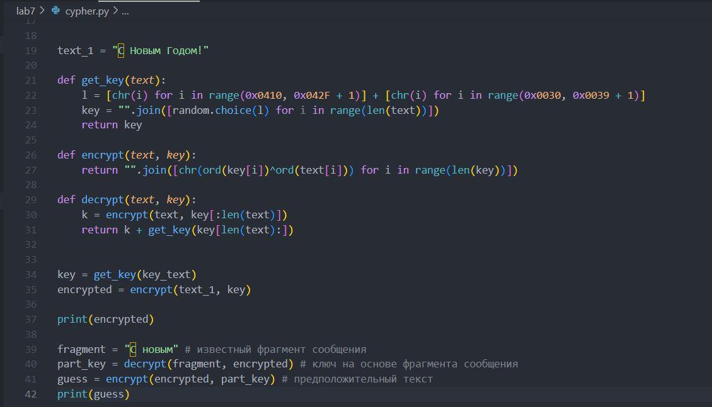

---
## Front matter
title: "Основы информационной безопасности"
subtitle: "Элементы криптографии. Однократное гаммирование"
author: "Сунгурова Мариян Мухсиновна"

## Generic otions
lang: ru-RU
toc-title: "Содержание"

## Bibliography
bibliography: bib/cite.bib
csl: pandoc/csl/gost-r-7-0-5-2008-numeric.csl

## Pdf output format
toc: true # Table of contents
toc-depth: 2
lof: true # List of figures
lot: false # List of tables
fontsize: 12pt
linestretch: 1.5
papersize: a4
documentclass: scrreprt
## I18n polyglossia
polyglossia-lang:
  name: russian
  options:
	- spelling=modern
	- babelshorthands=true
polyglossia-otherlangs:
  name: english
## I18n babel
babel-lang: russian
babel-otherlangs: english
## Fonts
mainfont: PT Serif
romanfont: PT Serif
sansfont: PT Sans
monofont: PT Mono
mainfontoptions: Ligatures=TeX
romanfontoptions: Ligatures=TeX
sansfontoptions: Ligatures=TeX,Scale=MatchLowercase
monofontoptions: Scale=MatchLowercase,Scale=0.9
## Biblatex
biblatex: true
biblio-style: "gost-numeric"
biblatexoptions:
  - parentracker=true
  - backend=biber
  - hyperref=auto
  - language=auto
  - autolang=other*
  - citestyle=gost-numeric
## Pandoc-crossref LaTeX customization
figureTitle: "Рис."
tableTitle: "Таблица"
listingTitle: "Листинг"
lofTitle: "Список иллюстраций"
lotTitle: "Список таблиц"
lolTitle: "Листинги"
## Misc options
indent: true
header-includes:
  - \usepackage{indentfirst}
  - \usepackage{float} # keep figures where there are in the text
  - \floatplacement{figure}{H} # keep figures where there are in the text
---

# Цель работы

Освоить на практике применение режима однократного гаммирования.

# Задание

Нужно подобрать ключ, чтобы получить сообщение «С Новым Годом, друзья!». Требуется разработать приложение, позволяющее шифровать и дешифровать данные в режиме однократного гаммирования. Приложение должно:

1. Определить вид шифротекста при известном ключе и известном открытом тексте.
2. Определить ключ, с помощью которого шифротекст может быть преобразован в некоторый фрагмент текста, представляющий собой один из возможных вариантов прочтения открытого текста.

# Теоретические сведения

Гаммиирование, или Шифр XOR, — метод симметричного шифрования, заключающийся в «наложении» последовательности, состоящей из случайных чисел, на открытый текст[@intro_crypto_2017]:. Последовательность случайных чисел называется гамма-последовательностью и используется для зашифровывания и расшифровывания данных. 

# Выполнение лабораторной работы

Создадим функции: `get_key` -- отвечает за генерацию случайного ключа(составляется выбором из букв кириллицы больших и малых, символов, цифр), `encrypt` -- принимает на вход текст и ключ, а затем осуществляет посимвольное сложение по модулю 2, `decrypt` -- подбирает точную часть ключа для известного фрагмента сообщения, а затем оставшуюся часть выбирает случайным образом(используются ранее описанные функции):

`def get_key(text):
    l = [chr(i) for i in range(0x0410, 0x042F + 1)] + [chr(i) for i in range(0x0030, 0x0039 + 1)]
    key = "".join([random.choice(l) for i in range(len(text))])
    return key
`
`
def encrypt(text, key):
    return "".join([chr(ord(key[i])^ord(text[i])) for i in range(len(key))])
`
`
def decrypt(text, key):
    k = encrypt(text, key[:len(text)])
    return k + get_key(key[len(text):])
`

Затем применим эти функции к заданному сообщению:

`key = get_key(key_text)
encrypted = encrypt(text_1, key)
`
`
print(encrypted)
`
`
fragment = "С новым" # известный фрагмент сообщения
part_key = decrypt(fragment, encrypted) # ключ на основе фрагмента сообщения
guess = encrypt(encrypted, part_key) # предположительный текст
print(guess)`

{#fig:001 width=70%}

В результате получим следующий вариант шифрования и один из вариантов прочтения текста(рис. @fig:002)

{#fig:002 width=70%}

# Контрольные вопросы

1. Поясните смысл однократного гаммирования.

Гаммиирование, или Шифр XOR, — метод симметричного шифрования, заключающийся в «наложении» последовательности, состоящей из случайных чисел, на открытый текст.
Если в методе шифрования используется однократная вероятностная гамма (однократное гаммирование) той же длины, что и подлежащий сокрытию текст, то текст нельзя раскрыть.

2. Перечислите недостатки однократного гаммирования.

- Если один и тот же ключ используется для шифрования нескольких сообщений, это может привести к уязвимостям. Например, если злоумышленник узнает открытый текст и соответствующий шифротекст, он может использовать эту информацию для взлома ключа.
- Однократное гаммирование не обеспечивает аутентификацию или целостность данных. Это означает, что злоумышленник может изменить шифротекст без заметных изменений в открытом тексте.

3. Перечислите преимущества однократного гаммирования.

- Однократное гаммирование обеспечивает высокий уровень конфиденциальности, поскольку шифротекст не может быть легко взломан без знания ключа.
- Однократное гаммирование обеспечивает равномерное распределение вероятностей для каждого символа в шифротексте, что делает его статистически неразличимым от случайной последовательности.
- Однократное гаммирование является простым и быстрым методом шифрования.

4. Почему длина открытого текста должна совпадать с длиной ключа?

Если в методе шифрования используется однократная вероятностная гамма (однократное гаммирование) той же длины, что и подлежащий сокрытию текст, то текст нельзя раскрыть.
   
5. Какая операция используется в режиме однократного гаммирования, назовите её особенности?

В режиме однократного гаммирования используется операция XOR (исключающее ИЛИ). Операция XOR комбинирует биты открытого текста и ключа, чтобы получить шифротекст. Особенностью операции XOR является то, что она возвращает 1 только в том случае, если один из входных битов равен 1, но не оба.

6. Как по открытому тексту и ключу получить шифротекст?

Нужно побитово сложить по модулю численное представление символов в ключе и в открытом тексте.

7. Как по открытому тексту и шифротексту получить ключ?

Нужно побитово сложить по модулю численное представление символов в шифротексте и в открытом тексте.

8. В чем заключаются необходимые и достаточные условия абсолютной стойкости шифра?

Необходимые и достаточные условия абсолютной стойкости шифра:

- полная случайность ключа;
- равенство длин ключа и открытого текста;
- однократное использование ключа.

# Выводы

В результате выполнения работы были освоены практические навыки применения режима однократного гаммирования.

# Список литературы{.unnumbered}

::: {#refs}
:::

