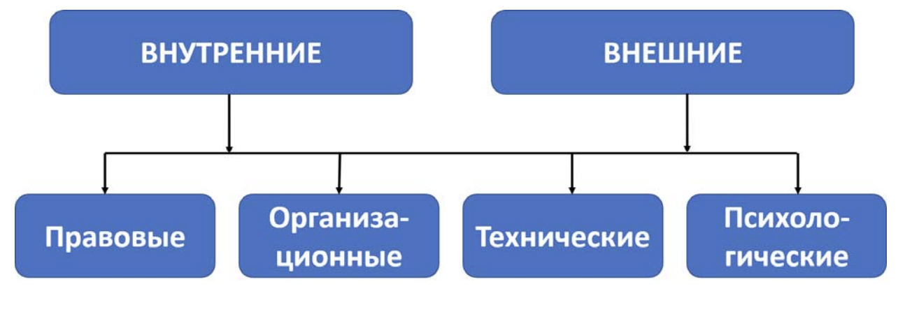
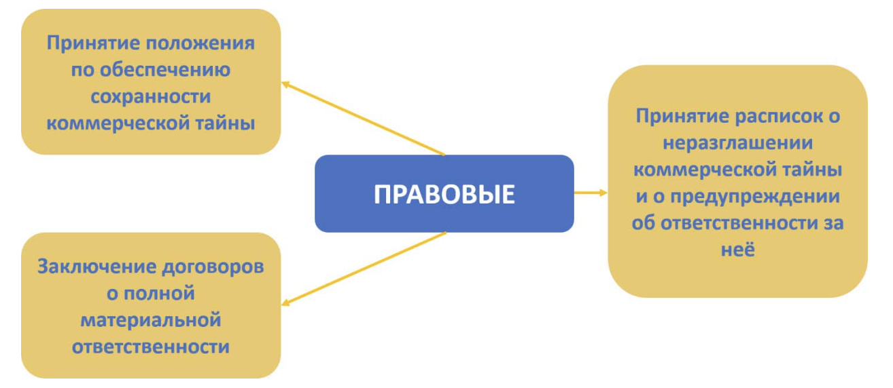
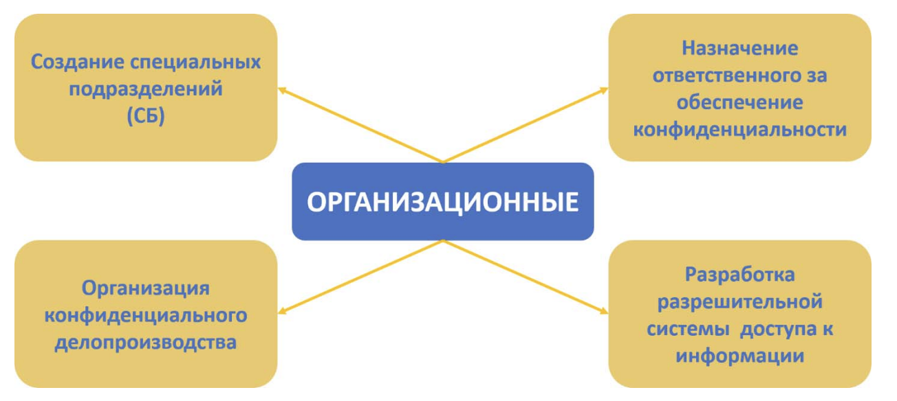
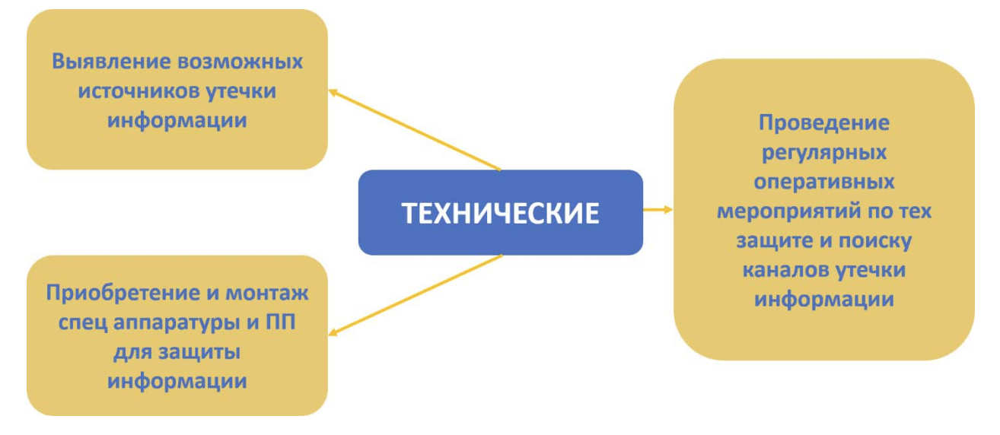
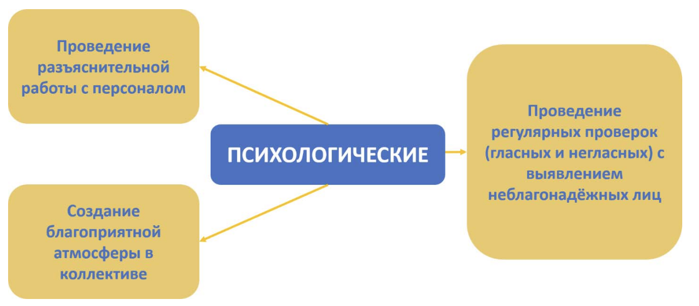

---
## Front matter
lang: ru-RU
title: Доклад
subtitle: Защита государственной и коммерческой тайны.
author:
  - Сунгурова М.М.
institute:
  - Российский университет дружбы народов, Москва, Россия
date: 23 сентября 2024

## i18n babel
babel-lang: russian
babel-otherlangs: english

## Formatting pdf
toc: false
toc-title: Содержание
slide_level: 2
aspectratio: 169
section-titles: true
theme: metropolis
header-includes:
 - \metroset{progressbar=frametitle,sectionpage=progressbar,numbering=fraction}
 - '\makeatletter'
 - '\beamer@ignorenonframefalse'
 - '\makeatother'
---

# Информация

## Докладчик

:::::::::::::: {.columns align=center}
::: {.column width="70%"}

  * Сунгурова Мариян Мухсиновна
  * Студентка группы НКНбд-01-21
  * Российский университет дружбы народов

:::
::: {.column width="30%"}

:::
::::::::::::::

# Введение

## Понятие тайны

Для реализации гарантий государственной безопасности в стране создана и функционирует система защищаемых законом тайн.

Признаки тайны: 

- сведения должны быть известны узкому кругу лиц;

- сведения не подлежат разглашению; 

- на лицах, которым доверена информация, не подлежащая оглашению, лежит правовая обязанность ее хранить; 

- за разглашение этих сведений устанавливается законом юридическая ответственность.

# Коммерческая тайна

## Коммерческая тайна

- Понятие коммерческая тайна определяет федеральный закон РФ «О коммерческой тайне» № 98-ФЗ.

- В п.2 ст.3 он определяет «информацию, составляющую коммерческую тайну»
	
- В п.1 ст.3  он определяет коммерческую тайну

## Меры по обеспечению защиты коммерческой тайны

Меры по обеспечению защиты коммерческой тайны условно можно разделить на внешние и внутренние.

{#fig:001 width=60%}

## Внутренние меры 

Направлены на рабочий персонал предприятия. Работники, имеющие доступ к сведениям обязуются: 

- сохранять КТ;

- выполнять требования по обеспечению сохранности КТ; 

- сохранять КТ деловых партнеров; 

- не использовать КТ для занятия деятельностью, которая может нанести ущерб предприятию; 

- в случае увольнения передать все носители информации, составляющей КТ

## Внешние меры

- Внешние меры по обеспечению сохранности коммерческой тайны необходимы при осуществлении деловых связей с партнерами. 

- Для этого в договоре специально должны быть оговорены характер и состав сведений, составляющих КТ, а также взаимные обязательства по обеспечению её сохранности. 

## Правовые меры

Правовые меры обеспечения сохранности КТ являются первоочередными

{#fig:001 width=60%}

## Организационные меры

{#fig:001 width=60%}

## Технические меры

{#fig:001 width=60%}

## Технические меры

Техническая защита коммерческой тайны строится на основе принципов:

- Ограничение доступа к системе.
- Назначение ролей.
- Уникальные логины и пароли с высокой надежностью.
- Доступ к системе только с определенных IP-адресов.
- Внедрение DLP-системы (Data Loss Prevention)

## Психологические меры

{#fig:001 width=60%}

# Государственная тайна

## Государственная тайна

- Государственная тайна — это информация, разглашение или несанкционированный доступ к которой может причинить ущерб государству.

Государство защищает данные в таких областях как:

- военная
- внешнеполитическая
- экономическая
- разведывательная
- контрразведывательная
- оперативно-розыскная 

## Организация защиты государственной тайны

- Согласно ст. 20 Закона “О государственной тайне” органы государственной власти, предприятия, учреждения и организации обеспечивают защиту сведений, составляющих государственную тайну, в соответствии с возложенными на них задачами и в пределах своей компетенции.

- Общие требования по организации и проведению работ по защите государственной тайны устанавливаются в Инструкции, утверждаемой Правительством РФ. 

## Организация защиты государственной тайны

К организационным мероприятиям можно отнести

- пропускной режим
- хранение устройств и носителей в сейфе
- ограничение доступа посторонних лиц в компьютерные помещения

## Организация защиты государственной тайны

Технические средства по защите информации государственной тайны включают в себя:
  
- экраны на аппаратуру;
- фильтры;
- ключи для блокировки клавиатуры;
- устройства аутентификации;
- электронные ключи на микросхемах.

## Организация защиты государственной тайны

К программным средствам защиты информации государственной относятся 

- блокировка клавиатуры и экрана;
- парольный доступ-задание;
- применение средств парольной защиты BIOS на персональный компьютер.

## Организация защиты государственной тайны

Правовые меры:

В статье 8 Закона Российской Федерации «О государственной тайне» определены три степени секретности сведений государственной тайны:

- секретно
- совершенно секретно
- особой важности. 
  
- Присвоение грифа секретности регламентировано Постановлением № 870 Правительства РФ.

## Организация защиты государственной тайны

Допуск граждан РФ и должностных лиц к государственной тайне реализуется в добровольном порядке

- принятие обязательств на себя перед государством по нераспространению сведений гос. тайны;
- согласие на временные ограничения их прав в соответствии с Федеральным законом РФ «О государственной тайне»;
- письменное согласие на проведение проверочных мероприятий;
- определение социальных гарантий, которые предусмотрены ФЗ «О государственной тайне»;
- ознакомление с законодательными нормами РФ;

## Организация защиты государственной тайны

Закон «О государственной тайне» предусматривает и уголовную ответственность, прописанную в четырех статьях УК РФ:

- Статья 275. Государственная измена. 
- Статья 276. Шпионаж.
- Статья 283. Разглашение государственной тайны. 
- Статья 284. Утрата документов, содержащих государственную тайну. 

# Заключение

Основные выводы:

- предприятия могут хранить коммерческие тайны и привлекать к ответственности за разглашение, при условии утвержденного режима коммерческой тайны

- Государственая тайна РФ имеет повышенную важность, ее разглашение недопустимо и карается по всей строгости закона.
  

# Список литературы

1. Н. С. Кармановский С.Л.С.-Н. ОРГАНИЗАЦИОННО-ПРАВОВЫЕ ОСНОВЫ ОХРАНЫ СЛУЖЕБНОЙ ТАЙНЫ НА ПРЕДПРИЯТИИ. Университет ИТМО, 2018. 69 с.
2. КРУТИН Ю.В. ЗАЩИТА КОММЕРЧЕСКОЙ ТАЙНЫ КОНСПЕКТ ЛЕКЦИЙ. 2020. 30 с.
