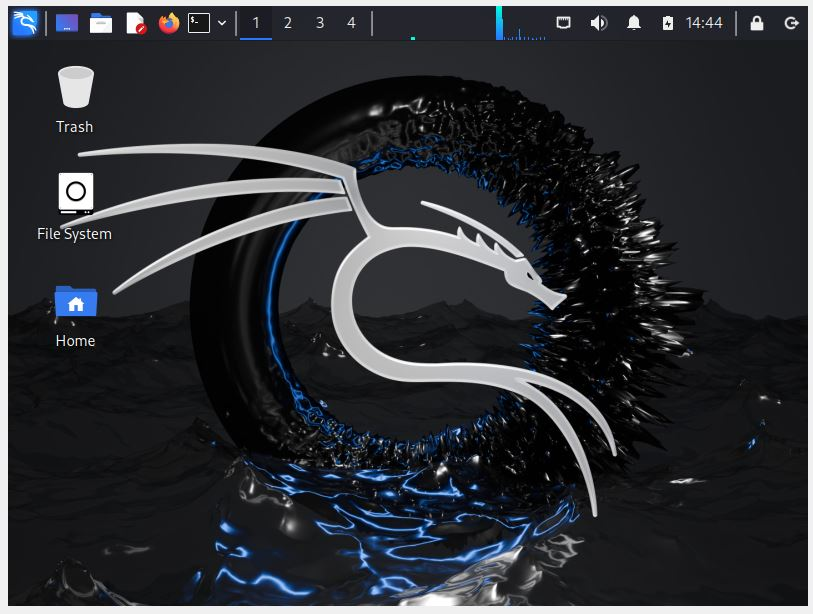

---
## Front matter
lang: ru-RU
title: Лабораторная работа №1
subtitle: 
author:
  - Сунгурова М.М.
institute:
  - Российский университет дружбы народов, Москва, Россия
date: 07 сентября 2024

## i18n babel
babel-lang: russian
babel-otherlangs: english

## Formatting pdf
toc: false
toc-title: Содержание
slide_level: 2
aspectratio: 169
section-titles: true
theme: metropolis
header-includes:
 - \metroset{progressbar=frametitle,sectionpage=progressbar,numbering=fraction}
 - '\makeatletter'
 - '\beamer@ignorenonframefalse'
 - '\makeatother'
---

# Информация

## Докладчик

:::::::::::::: {.columns align=center}
::: {.column width="70%"}

  * Сунгурова Мариян Мухсиновна
  * НКНбд-01-21
  * Российский университет дружбы народов

:::
::: {.column width="30%"}

:::
::::::::::::::

# Вводная часть

## Постановка задачи

Целью данной работы является установка дистрибутива Kali Linux в виртуальную машину.

## Выполнение лабораторной работы

Скачаемаем образ Kali Linux[@kali:bash]. Создадим виртуальную машину. 

{#fig:001 width=70%}

## Выполнение лабораторной работы

Добавим новый привод оптических дисков и выберите образ операционной системы, укажем имя виртуальной машины, тип операционной системы -- Linux, Debian (64-bit), рамзер основной памяти  -- 2048 МБ,  конфигурацию жёсткого диска — загрузочный, VDI (BirtualBox Disk Image), динамический виртуальный диск,  размер диска — 40 ГБ (или больше)(рис. @fig:002 ).

{#fig:002 width=70%}

## Выполнение лабораторной работы

Установим имя хоста, пользователя и пароль суперпользователя(рис. @fig:003 - @fig:005):

{#fig:003 width=70%}

## Выполнение лабораторной работы

{#fig:004 width=70%}

## Выполнение лабораторной работы

{#fig:005 width=70%}

## Выполнение лабораторной работы

Установим пароль для root и пользователя с правами администратора.

{#fig:006 width=70%}

## Выполнение лабораторной работы

{#fig:007 width=70%}

## Выполнение лабораторной работы

Выберем базовое ПО для начальной установки(рис. @fig:008):

{#fig:008 width=70%}

## Выполнение лабораторной работы

Вход в аккаунт(рис. @fig:009, @fig:010):

{#fig:009 width=40%}

{#fig:010 width=40%}

# Выводы

## Выводы

В результате выполнения работы был уавстановлен дистрибутив Kali Linux в виртуальную машину.

