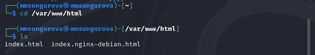
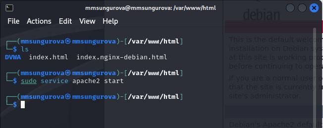
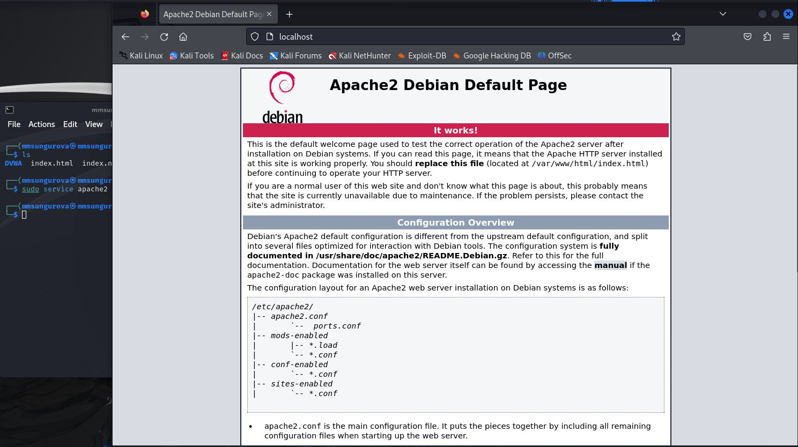
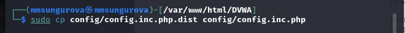
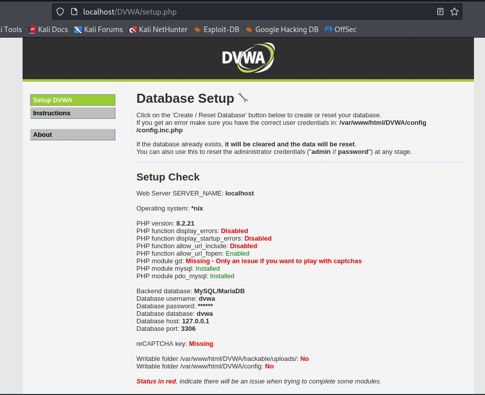
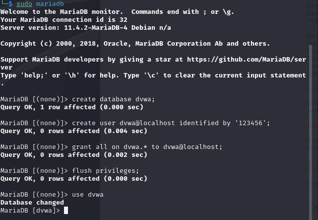
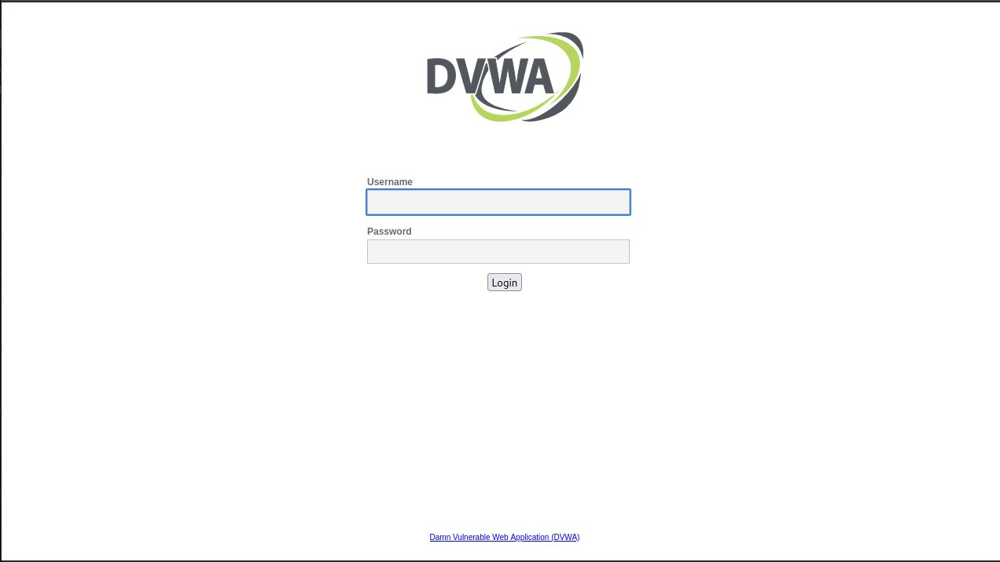
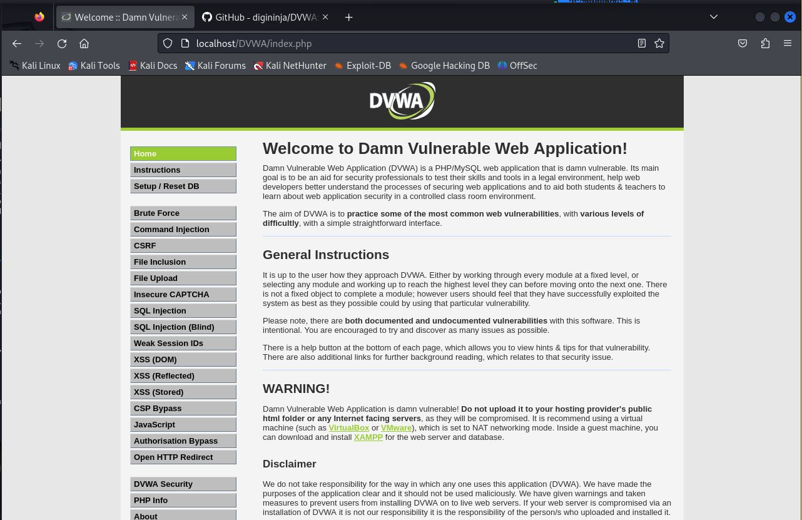

---
## Front matter
lang: ru-RU
title: "Основы информационной безопасности"
subtitle: "Индивидуальный проект. Этап № 2. Установка DVWA"
author: "Сунгурова Мариян М."
institute:
  - Российский университет дружбы народов, Москва, Россия
 
## i18n babel
babel-lang: russian
babel-otherlangs: english

## Formatting pdf
toc: false
toc-title: Содержание
slide_level: 2
aspectratio: 169
section-titles: true
theme: metropolis
header-includes:
 - \metroset{progressbar=frametitle,sectionpage=progressbar,numbering=fraction}
 - '\makeatletter'
 - '\beamer@ignorenonframefalse'
 - '\makeatother'
---

# Информация

## Докладчик

:::::::::::::: {.columns align=center}
::: {.column width="70%"}

  * Сунгурова М. М.
  * Студент
  * НКНбд-01-21
  * Российский университет дружбы народов

:::
::: {.column width="30%"}

:::
::::::::::::::

# Вводная часть

## Цель и задание

Установить DVWA в гостевую систему к Kali Linux.

## Теоретическое введение

Damn Vulnerable Web Application (DVWA) -- это веб-приложение PHP/MySQL, которое чертовски уязвимо. Его основная цель -- помочь специалистам по безопасности проверить свои навыки и инструменты в правовой среде, помочь веб-разработчикам лучше понять процессы обеспечения безопасности веб-приложений, а также помочь студентам и преподавателям узнать о безопасности веб-приложений в контролируемой обстановке.

# Выполнение лабораторной работы

## Выполнение

Перейдем в каталог /etc/www/html (рис. @fig:001)

{#fig:001 width=70%}

## Выполнение

Скопируем в каталог /etc/www/html файлы веб-приложения DVWA с github:(рис. @fig:002)

{#fig:002 width=70%}

## Выполнение

Затем запускаем веб сервер (рис. @fig:003)

{#fig:003 width=70%}

## Выполнение

Скопируем файл конфигурации (рис. @fig:004, @fig:005)

{#fig:004 width=30%}

{#fig:005 width=30%}

## Выполнение

Просмотр стартового окна DVWA  (рис. @fig:006)

{#fig:006 width=70%}

## Выполнение

Запустим сервер mariadb и создадим на нем пользователя(имя и пароль совпадают с данными в файле конфигураций dvwa)(рис. @fig:007).

{#fig:007 width=70%}

## Выполнение

Затем на стартовом окне DVWA нажмем кнопку `Create/Reset Database`, чтобы попасть на страницу ввода данных учетной записи. После ввода увидим рабочую область DVWA (рис. @fig:008, @fig:009).

{#fig:008 width=40%}

{#fig:009 width=40%}

# Выводы

## Выводы

В результате выполнения данного этапа персонального проекта был установлен DVWA на Kali Linux.

