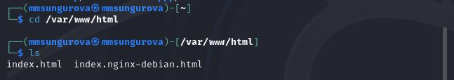
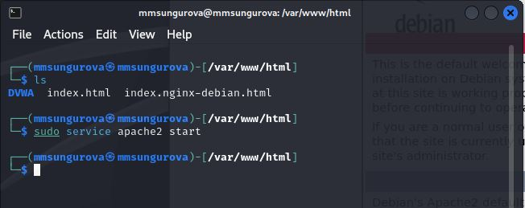
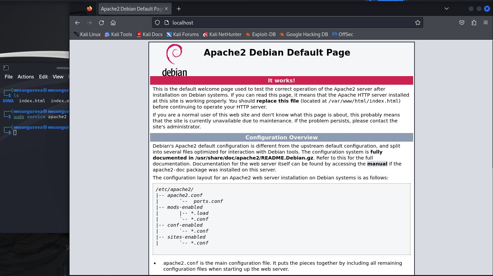
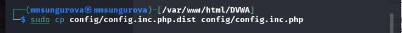
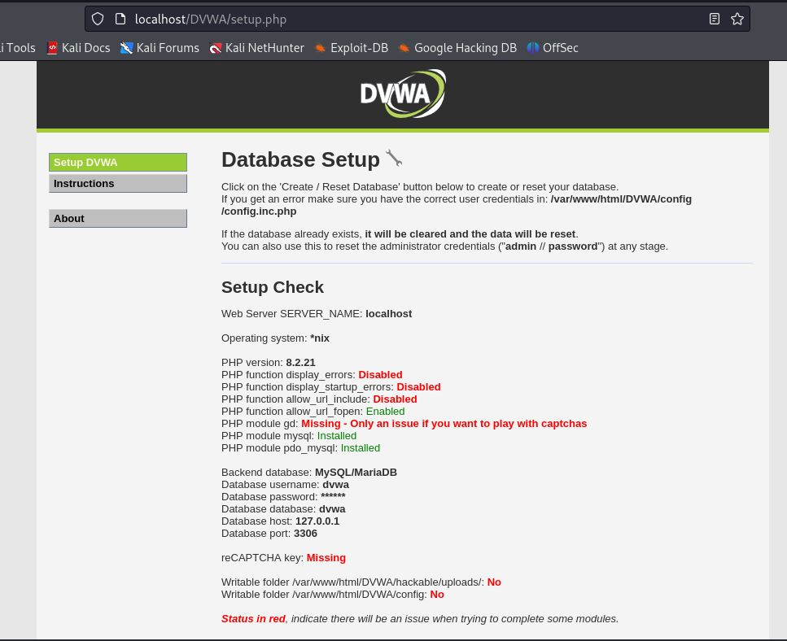
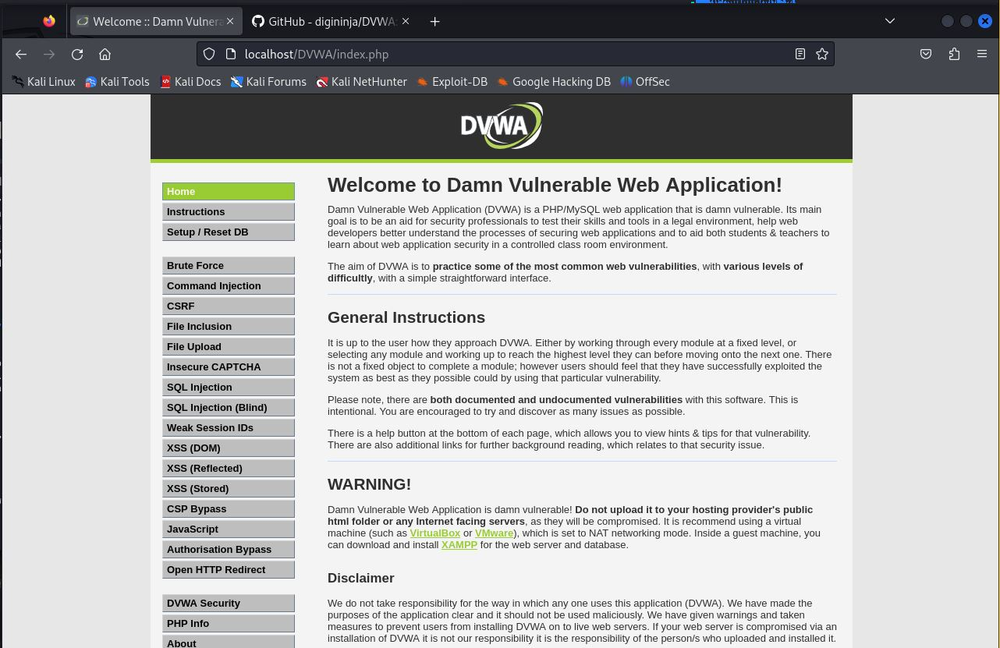

---
## Front matter
title: "Основы информационной безопасности"
subtitle: "Индивидуальный проект. Этап № 2. Установка DVWA"
author: "Сунгурова Мариян М."

## Generic otions
lang: ru-RU
toc-title: "Содержание"

## Bibliography
bibliography: bib/cite.bib
csl: pandoc/csl/gost-r-7-0-5-2008-numeric.csl

## Pdf output format
toc: true # Table of contents
toc-depth: 2
lof: true # List of figures
lot: true # List of tables
fontsize: 12pt
linestretch: 1.5
papersize: a4
documentclass: scrreprt
## I18n polyglossia
polyglossia-lang:
  name: russian
  options:
	- spelling=modern
	- babelshorthands=true
polyglossia-otherlangs:
  name: english
## I18n babel
babel-lang: russian
babel-otherlangs: english
## Fonts
mainfont: PT Serif
romanfont: PT Serif
sansfont: PT Sans
monofont: PT Mono
mainfontoptions: Ligatures=TeX
romanfontoptions: Ligatures=TeX
sansfontoptions: Ligatures=TeX,Scale=MatchLowercase
monofontoptions: Scale=MatchLowercase,Scale=0.9
## Biblatex
biblatex: true
biblio-style: "gost-numeric"
biblatexoptions:
  - parentracker=true
  - backend=biber
  - hyperref=auto
  - language=auto
  - autolang=other*
  - citestyle=gost-numeric
## Pandoc-crossref LaTeX customization
figureTitle: "Рис."
tableTitle: "Таблица"
listingTitle: "Листинг"
lofTitle: "Список иллюстраций"
lotTitle: "Список таблиц"
lolTitle: "Листинги"
## Misc options
indent: true
header-includes:
  - \usepackage{indentfirst}
  - \usepackage{float} # keep figures where there are in the text
  - \floatplacement{figure}{H} # keep figures where there are in the text
---

# Цель работы

Целью данной работы является установка DVWA на Kali Linux.

# Задание

Установить DVWA в гостевую систему к Kali Linux.

# Теоретическое введение

Damn Vulnerable Web Application (DVWA) -- это веб-приложение PHP/MySQL, которое чертовски уязвимо[~@dvwa]. Его основная цель -- помочь специалистам по безопасности проверить свои навыки и инструменты в правовой среде, помочь веб-разработчикам лучше понять процессы обеспечения безопасности веб-приложений, а также помочь студентам и преподавателям узнать о безопасности веб-приложений в контролируемом классе. обстановка помещения.

Цель DVWA -- отработать некоторые из наиболее распространенных веб-уязвимостей различного уровня сложности с помощью простого и понятного интерфейса. В этом программном обеспечении существуют как задокументированные, так и недокументированные уязвимости.

Некоторые из уязвимостей веб приложений, который содержит DVWA:

- Брутфорс: Брутфорс HTTP формы страницы входа - используется для тестирования инструментов по атаке на пароль методом грубой силы и показывает небезопасность слабых паролей.
- Исполнение (внедрение) команд: Выполнение команд уровня операционной системы.
- Межсайтовая подделка запроса (CSRF): Позволяет «атакующему» изменить пароль администратора приложений.
- Внедрение (инклуд) файлов: Позволяет «атакующему» присоединить удалённые/локальные файлы в веб приложение.
- SQL внедрение: Позволяет «атакующему» внедрить SQL выражения в HTTP из поля ввода, DVWA включает слепое и основанное на ошибке SQL внедрение.
- Небезопасная выгрузка файлов: Позволяет «атакующему» выгрузить вредоносные файлы на веб сервер.
- Межсайтовый скриптинг (XSS): «Атакующий» может внедрить свои скрипты в веб приложение/базу данных. DVWA включает отражённую и хранимую XSS.
- Пасхальные яйца: раскрытие полных путей, обход аутентификации и некоторые другие.

DVWA имеет три уровня безопасности, они меняют уровень безопасности каждого веб приложения в DVWA:

- Невозможный — этот уровень должен быть безопасным от всех уязвимостей. Он используется для сравнения уязвимого исходного кода с безопасным исходным кодом.
- Высокий — это расширение среднего уровня сложности, со смесью более сложных или альтернативных плохих практик в попытке обезопасить код. Уязвимости не позволяют такой простор эксплуатации как на других уровнях.
- Средний — этот уровень безопасности предназначен главным образом для того, чтобы дать пользователю пример плохих практик безопасности, где разработчик попытался сделать приложение безопасным, но потерпел неудачу.
- Низкий — этот уровень безопасности совершенно уязвим и совсем не имеет защиты. Его предназначение быть примером среди уязвимых веб приложений, примером плохих практик программирования и служить платформой обучения базовым техникам эксплуатации.

# Выполнение лабораторной работы

Перейдем в каталог /etc/www/html (рис. @fig:001)

{#fig:001 width=70%}

Скопируем в каталог /etc/www/html файлы веб-приложения DVWA с github:(рис. @fig:002)

{#fig:002 width=70%}

Затем запускаем веб сервер (рис. @fig:003)

{#fig:003 width=70%}

Скопируем файл конфигурации (рис. @fig:004, @fig:005)

{#fig:004 width=70%}

{#fig:005 width=70%}

Просмотр стартового окна DVWA  (рис. @fig:006)

{#fig:006 width=70%}

Запустим сервер mariadb и создадим на нем пользователя(имя и пароль совпадают с данными в файле конфигураций dvwa)(рис. @fig:007).

{#fig:007 width=70%}

Затем на стартовом окне DVWA нажмем кнопку `Create/Reset Database`, чтобы попасть на страницу ввода данных учетной записи. После ввода увидим рабочую область DVWA (рис. @fig:008, @fig:009).

{#fig:008 width=70%}

{#fig:009 width=70%}

# Выводы

В результате выполнения данного этапа персонального проекта был установлен DVWA на Kali Linux.

# Список литературы{.unnumbered}

::: {#refs}
:::
