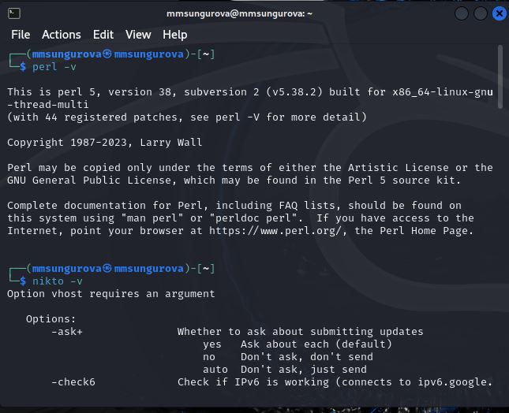
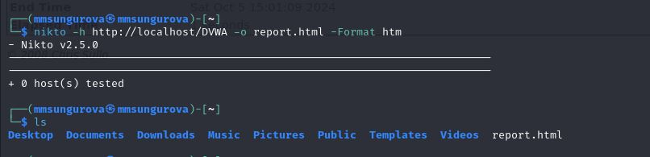
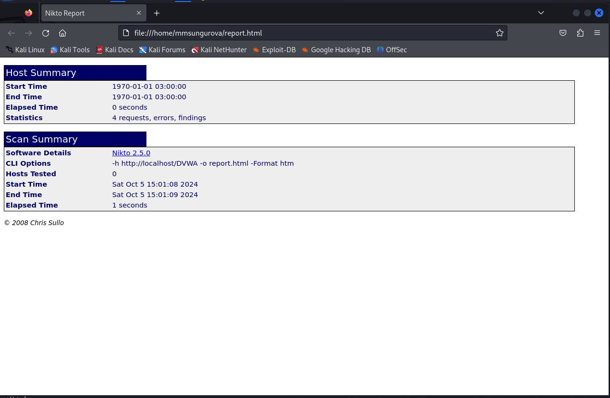
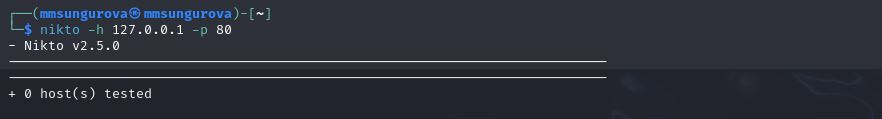

---
## Front matter
title: "Основы информационной безопасности"
subtitle: "Индивидуальный проект. Этап № 4. Использование Nikto"
author: "Сунгурова Мариян М."

## Generic otions
lang: ru-RU
toc-title: "Содержание"

## Bibliography
bibliography: bib/cite.bib
csl: pandoc/csl/gost-r-7-0-5-2008-numeric.csl

## Pdf output format
toc: true # Table of contents
toc-depth: 2
lof: true # List of figures
lot: false # List of tables
fontsize: 12pt
linestretch: 1.5
papersize: a4
documentclass: scrreprt
## I18n polyglossia
polyglossia-lang:
  name: russian
  options:
	- spelling=modern
	- babelshorthands=true
polyglossia-otherlangs:
  name: english
## I18n babel
babel-lang: russian
babel-otherlangs: english
## Fonts
mainfont: PT Serif
romanfont: PT Serif
sansfont: PT Sans
monofont: PT Mono
mainfontoptions: Ligatures=TeX
romanfontoptions: Ligatures=TeX
sansfontoptions: Ligatures=TeX,Scale=MatchLowercase
monofontoptions: Scale=MatchLowercase,Scale=0.9
## Biblatex
biblatex: true
biblio-style: "gost-numeric"
biblatexoptions:
  - parentracker=true
  - backend=biber
  - hyperref=auto
  - language=auto
  - autolang=other*
  - citestyle=gost-numeric
## Pandoc-crossref LaTeX customization
figureTitle: "Рис."
tableTitle: "Таблица"
listingTitle: "Листинг"
lofTitle: "Список иллюстраций"
lotTitle: "Список таблиц"
lolTitle: "Листинги"
## Misc options
indent: true
header-includes:
  - \usepackage{indentfirst}
  - \usepackage{float} # keep figures where there are in the text
  - \floatplacement{figure}{H} # keep figures where there are in the text
---

# Постановка задачи

Целью данной лабораторной работы является использование Nikto для сканирования уязвимостей веб-приложения.

# Теоретические сведения

Damn Vulnerable Web Application (DVWA) -- это веб-приложение PHP/MySQL, которое чертовски уязвимо[~@dvwa]. Его основная цель -- помочь специалистам по безопасности проверить свои навыки и инструменты в правовой среде, помочь веб-разработчикам лучше понять процессы обеспечения безопасности веб-приложений, а также помочь студентам и преподавателям узнать о безопасности веб-приложений в контролируемом классе. обстановка помещения.

Цель DVWA -- отработать некоторые из наиболее распространенных веб-уязвимостей различного уровня сложности с помощью простого и понятного интерфейса. В этом программном обеспечении существуют как задокументированные, так и недокументированные уязвимости.

DVWA имеет три уровня безопасности, они меняют уровень безопасности каждого веб приложения в DVWA:

- Невозможный — этот уровень должен быть безопасным от всех уязвимостей. Он используется для сравнения уязвимого исходного кода с безопасным исходным кодом.
- Высокий — это расширение среднего уровня сложности, со смесью более сложных или альтернативных плохих практик в попытке обезопасить код. Уязвимости не позволяют такой простор эксплуатации как на других уровнях.
- Средний — этот уровень безопасности предназначен главным образом для того, чтобы дать пользователю пример плохих практик безопасности, где разработчик попытался сделать приложение безопасным, но потерпел неудачу.
- Низкий — этот уровень безопасности совершенно уязвим и совсем не имеет защиты. Его предназначение быть примером среди уязвимых веб приложений, примером плохих практик программирования и служить платформой обучения базовым техникам эксплуатации.

Nikto – бесплатный (open source) сканер для поиска уязвимостей в веб-серверах[~@nikto].

В начале сканирования всегда отображается следующий блок с информацией:

- Target IP: IP адрес сканируемого домена.
- Target Hostname: имя хоста (доменное имя) сканируемого сайта;
- Target Port: порт, на котором находится сайт;
- Start Time: дата и время начала сканирования в формате год-месяц-день час:минута:секунда.

Вывод результатов сканирования имеет несколько форматов:

1. Формат: Тип компонента сайта: Наименование компонента. Пример: Server: nginx.
2. Описание: Nikto умеет определять, какие компоненты использует сайт. Сюда относят наименование веб-сервера, используемой СУБД, фреймворков, языков программирования, а также их версии. Формат: путь до файла/директории, где найдена уязвимость: описание уязвимости. Пример: /phpinfo.php: Output from the phpinfo() function was found.

# Выполнение лабораторной работы

Проверим, что nikto установлен(рис. @fig:001)

{#fig:001 width=70%}

Затем проверим сайт DVWA, указав опции для сохранения отчета в формате html(рис. @fig:002, ).

{#fig:002 width=70%}

{#fig:003 width=70%}

Также можно посмотреть информацию об уязвимостях по конкретному порту(в нашем случае порт 80 для локального хоста)(рис. @fig:004).

{#fig:004 width=70%}

# Выводы

В результате выполнения данной лабораторной работы был использован сканер Nikto для сканирования уязвимостей веб-приложения.

# Список литературы{.unnumbered}

::: {#refs}
:::

