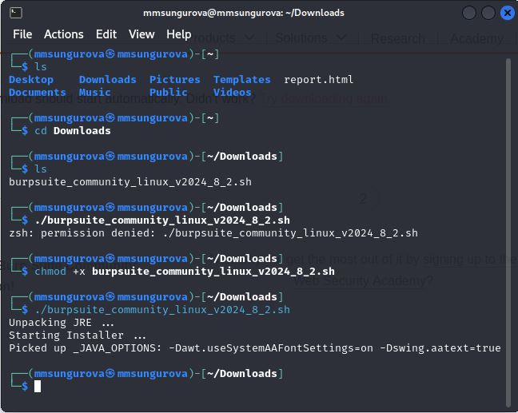
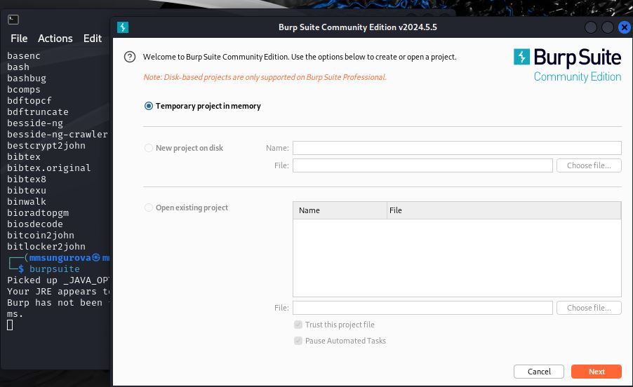
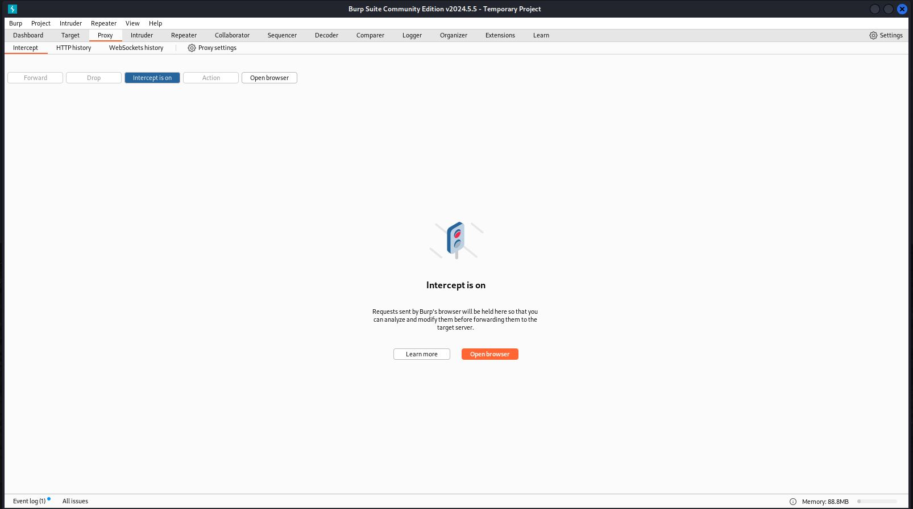
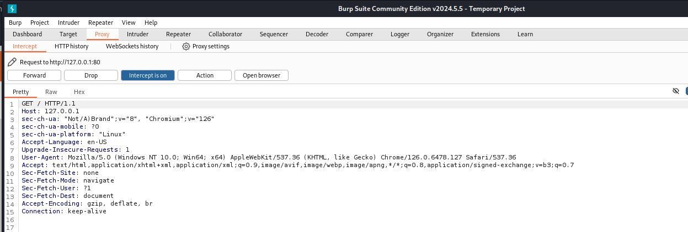
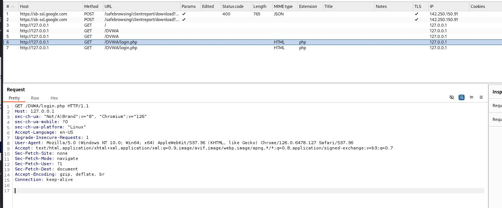

---
## Front matter
lang: ru-RU
title: "Основы информационной безопасности"
subtitle: "Индивидуальный проект. Этап № 5. Использование Burp Suite"
author:
  -Сунгурова М.
institute:
  - Российский университет дружбы народов, Москва, Россия
  

## i18n babel
babel-lang: russian
babel-otherlangs: english

## Formatting pdf
toc: false
toc-title: Содержание
slide_level: 2
aspectratio: 169
section-titles: true
theme: metropolis
header-includes:
 - \metroset{progressbar=frametitle,sectionpage=progressbar,numbering=fraction}
 - '\makeatletter'
 - '\beamer@ignorenonframefalse'
 - '\makeatother'
---

# Информация

## Докладчик

:::::::::::::: {.columns align=center}
::: {.column width="70%"}

  * Сунгурова Мариян Мухсиновна
  * НКНбд-01-21
  * Российский университет дружбы народов

:::
::: {.column width="30%"}

:::
::::::::::::::

# Постановка задачи

Целью данной работы является использование Burp Suit для перехвата, изменения и изучения HTTP запросов и ответов. 

# Теоретические сведения

Damn Vulnerable Web Application (DVWA) -- это веб-приложение PHP/MySQL, которое чертовски уязвимо. Его основная цель -- помочь специалистам по безопасности проверить свои навыки и инструменты в правовой среде, помочь веб-разработчикам лучше понять процессы обеспечения безопасности веб-приложений, а также помочь студентам и преподавателям узнать о безопасности веб-приложений в контролируемом классе. обстановка помещения.

Цель DVWA -- отработать некоторые из наиболее распространенных веб-уязвимостей различного уровня сложности с помощью простого и понятного интерфейса. В этом программном обеспечении существуют как задокументированные, так и недокументированные уязвимости.

## Теоретические сведения

DVWA имеет три уровня безопасности, они меняют уровень безопасности каждого веб приложения в DVWA:

- Невозможный — этот уровень должен быть безопасным от всех уязвимостей. Он используется для сравнения уязвимого исходного кода с безопасным исходным кодом.
- Высокий — это расширение среднего уровня сложности, со смесью более сложных или альтернативных плохих практик в попытке обезопасить код. Уязвимости не позволяют такой простор эксплуатации как на других уровнях.
- Средний — этот уровень безопасности предназначен главным образом для того, чтобы дать пользователю пример плохих практик безопасности, где разработчик попытался сделать приложение безопасным, но потерпел неудачу.
- Низкий — этот уровень безопасности совершенно уязвим и совсем не имеет защиты. Его предназначение быть примером среди уязвимых веб приложений, примером плохих практик программирования и служить платформой обучения базовым техникам эксплуатации.

Burp Suite — это интегрированная платформа для тестирования безопасности веб-приложений как в ручном, так и в автоматических режимах.

## Теоретические сведения

Пакет состоит из набора утилит, среди которых есть инструменты для сбора и анализа информации, моделирования разных типов атак, перехвата запросов и ответов сервера и так далее.

- Target -- создает карту сайта с подробной информацией о тестируемом приложении. Показывает, какие цели находятся в процессе тестирования, и позволяет управлять процессом обнаружения уязвимостей.
- Proxy -- находится между браузером пользователя и тестируемым веб-приложением. Перехватывает все сообщения, передаваемые по протоколу HTTP(S).
- Spider -- автоматически собирает данные о функциях и компонентах веб-приложения. 
- Clickbandit -- моделирует кликджекинг-атаки (clickjacking attacks), при которых поверх страницы приложения загружается невидимая страница, подготовленная злоумышленниками.
- DOM Invader -- проверяет веб-приложение на уязвимость DOM-based межсайтовому скриптингу ( основанномуна объектной модели документа), внедрению вредоносного кода на страницу.

## Теоретические сведения

- Scanner (в профессиональной и корпоративной редакциях) — автоматически сканирует уязвимости в веб-приложениях. Также существует в бесплатной версии, но, предоставляет только описание возможностей.
Intruder -- проводит автоматические атаки различного типа, от перебора открытых веб-директорий до внедрения SQL-кода.
- Repeater -- утилита для ручного манипулирования и повторной выдачи отдельных HTTP-запросов и анализа ответов приложения. Отправить запрос в Repeater можно из любой другой утилиты Burp Suite.
- Sequencer -- анализирует качество случайности в выборке элементов данных. Можно использовать для тестирования сеансовых маркеров приложения или других важных элементов данных, которые должны быть непредсказуемыми, например маркеров анти-CSRF, маркеров сброса пароля и так далее.
Decoder--— преобразовывает закодированные данные в исходную форму или необработанные в различные закодированные и хешированные формы. Способен распознавать несколько форматов кодирования, используя эвристические методы.
Comparer -- предоставляет функцию визуального сравнения различий данных.

# Выполнение лабораторной работы

Intercept HTTP traffic with Burp Proxy

Установим Burp Suit с официального сайта(рис. @fig:001)

{#fig:001 width=70%}

## Выполнение лабораторной работы

Откроем приложение и создадим временный проект с параметрами по умолчанию(рис. @fig:002).

{#fig:002 width=70%}

## Выполнение лабораторной работы

Теперь попробуем перехватить http запрос с помощью Burp Proxy. Включим перехват, а в браузере включим прокси и укажем для него адрес локального хоста, а также установим параметр, разрешающий перехват запросов локального хоста(рис. @fig:004).

{#fig:004 width=70%}

## Выполнение лабораторной работы

Можем увидеть первый перехваченный запрос: вход на сайт DVWA. Указаны адрес локального хоста, версия браузера, ОС устройства и другая информация(рис. @fig:007):

{#fig:007 width=70%}

## Выполнение лабораторной работы

В запросах можно изменять вводимую нформацию и сравнивать ответы(рис. @fig:010):

{#fig:010 width=70%}

# Выводы

В результате выполнения работы научились на практике использовать ПО Burp Suit для перехвата, изменения и изучения HTTP запросов и ответов. 

